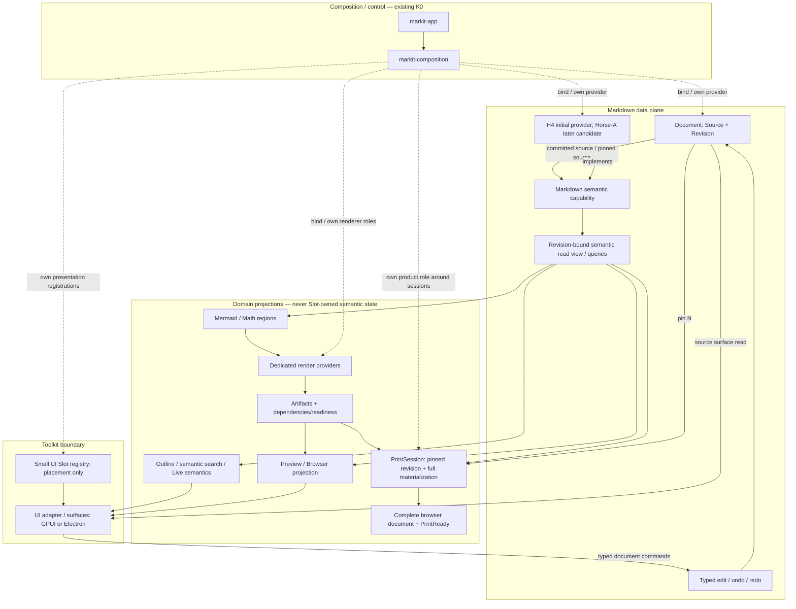

# Markit Product Architecture — Markdown-Centric Data Plane v1

Status: **FROZEN PRODUCT ARCHITECTURE BOUNDARY**

Authority scope: this document is the normative product-architecture authority for the Markit product line. It replaces the previous whole-product architecture HOLD. Parser / incremental-update research remains independently unfrozen where explicitly listed below.

Evidence basis fixed for this decision:

- Markit product foundation after PR #108 (`dev/markit-product` at `e885bcaca404f8765f00dd72899815571cbfa0b7`);
- DeepSeek Harness implemented client/slot architecture at `639ed015397290b3745d163aafe02ffee4aa3f84`;
- qianqian generic composition donor at `ba545ee5927e1c19963dee85922569668a3fa023`;
- the 2026-10-01 independent Markit × DeepSeek Harness architecture review.

The frozen decision is intentionally narrower than an implementation blueprint:

> Markit is a Markdown-centric product. Markdown source is the document-content truth; all Markdown-aware semantics and projections derive from an explicit document revision. K0 owns composition/lifecycle, the Markdown data plane owns typed edit-to-semantic flow, and UI Slots own presentation placement only. These are responsibilities, not three independent runtimes.

The architecture MUST preserve the ability to replace the initial Markdown backend without exposing backend-private representation to Document, projections, Print, Workbench, or UI.

---

## 1. Architectural center

Markit's product architecture is centered on this authority/data flow:

```text
Markdown Source
      +
   Revision
      |
      v
Document
      |
      v
Markdown semantic capability
      |
      v
revision-bound semantic read view
      |
      +---- Source/Live semantics
      +---- Outline / semantic search
      +---- Preview
      +---- Mermaid / Math regions
      +---- Browser
      +---- Print
```

This does **not** mean every piece of application state is Markdown data. Window geometry, focus, panel visibility, theme, selection, scroll position, IME preedit, task handles and other UI/runtime state have their own owners.

The governing distinction is:

> If state determines what a Markdown document contains, what that Markdown means, or what semantic content Preview/Browser/Print exposes, it must trace back to the same Document source and explicit revision/semantic configuration. UI state may not become a second document or Markdown authority.

---

## 2. One content root, two distinct responsibilities

### 2.1 Document owns document-content truth

A concrete open `Document` / buffer is the document authority. It owns at least the semantics of:

```text
source
source revision
edit commit
base-revision validation
undo/redo transaction history
snapshot/pin lifetime
saved baseline / dirty relationship
close/retention policy
```

Rules:

1. Source Mode and Live Mode write through the same Document commit authority.
2. Mode switching does not itself rewrite source.
3. Undo/redo are new commits; source revision must not move backwards or reuse a prior revision identity (no ABA reuse).
4. A stale base-revision edit is rejected explicitly unless a separately specified operation performs a valid rebase.
5. Filesystem/watch/workspace state may observe or persist a Document, but may not silently overwrite unsaved Document source.
6. Basic source editing and plain-text source search do not require semantic parsing to complete first.

### 2.2 Markdown semantics owns Markdown interpretation, not source

There is one product-level Markdown interpretation contract, supplied as a typed semantic capability/service.

It owns:

```text
Markdown dialect / extension interpretation
semantic queries
semantic indexes / derived state
embedded-region discovery
```

It does **not** own:

```text
source writes
save policy
workspace truth
undo authority
window/UI state
```

The semantic service may internally use one tree, many local structures, events, checkpoints, caches or no stable tree at all. Those representations are not product authority.

A consumer may never require H4/Horse-A/private parser node types.

---

## 3. Identity and versioning

`Source + Revision` is necessary but not sufficient to identify every derived result.

The product architecture distinguishes these identity/dependency classes:

| Concept | Frozen semantic meaning | Representation remains open |
|---|---|---|
| Document identity | distinguishes open document/buffer instances | UUID/integer/persistence form |
| Source revision | identifies one committed source state; no ABA reuse | width/storage format |
| Semantic view identity | Document + source revision + semantic configuration | public key shape/hash/epoch |
| Source location | explicit coordinate system bound to one revision | rope anchors/index structures |
| Snapshot-local semantic token | locates a semantic object inside one read view | node/token representation |
| Artifact dependency | semantic input + provider/config/resource/target dependencies | hash/cache-key format |

Cross-revision stable block/heading/node identity is **not** frozen.

A result is acceptable only if its target identity and relevant dependencies match the consumer's requested view. Comparing only `revision == N` is insufficient when semantic configuration, provider generation or mutable external resources differ.

---

## 4. The three architectural planes

These planes are responsibility boundaries. They MUST NOT become duplicate runtime frameworks.

### 4.1 Composition / control plane — existing K0

Owned by:

```text
markit-composition
markit-app
```

K0 answers:

```text
what product roles exist?
which provider satisfies a capability?
who owns activation/disposal?
which composition is desired?
```

K0 does not transport per-edit Markdown data.

The hot edit/query path MUST NOT repeatedly enter:

```text
CompositionKernel
registry lookup
Desired reconciliation
UI Slot lookup
```

K0 binds/owns providers at activation/retirement boundaries; domain hot paths use the already-bound typed face.

K0 `Fiber` is a composition-lifetime unit. K0 `Effect` is an inverse/lifecycle record. Neither is a generic asynchronous-task executor.

### 4.2 Markdown data plane — direct typed domain path

The minimum causal path is:

```text
typed edit command
      ↓
Document commit
      ↓
Markdown semantic session/provider update
      ↓
revision-bound semantic read view
      ↓
domain projection / renderer input
```

The arrows specify ownership and correctness dependencies, not mandatory synchronous execution.

Rules:

1. Document commit may complete before semantic recomputation completes.
2. Parser placement (sync/async/worker) remains an implementation/performance decision.
3. Content commits are never implemented as broadcast events whose listener ordering determines correctness.
4. A generic EventBus is not part of the edit/parse path.
5. A semantic provider must consume an ordered, well-defined sequence of changes or explicitly reset/rebuild from a pinned source snapshot.
6. A change based on revision N must not be blindly applied to N+k when offsets/coordinates are no longer valid.
7. Heavy Mermaid/math/layout/browser/GPU work is downstream of semantic interpretation and is not parser-critical-path work.

### 4.3 Presentation plane — UI topology and toolkit adapter

UI composition is downstream of domain reads/projections.

Slots answer:

```text
where may a feature contribute presentation?
who owns that placement?
when is that contribution valid?
```

Slots do not answer:

```text
what does this Markdown mean?
which bytes changed?
which parser handles the edit?
```

Slots are not a data bus, service locator or semantic registry.

---

## 5. Semantic publication: observable latest state + pinned read views

The architecture adopts a mixed push/pull contract.

### 5.1 Latest/availability face

Consumers may observe notifications such as:

```text
semantic view N available
semantic view invalidated/failed
save completed/failed
external file conflict observed
renderer job terminal
print session terminal
```

These are post-fact typed notifications. They may be coalesced according to workload policy.

A listener failure does not roll back an already committed Document edit.

### 5.2 Pinned semantic read view

Queries operate against an explicit read view bound to a Document/source revision/semantic configuration.

A pinned read view MUST NOT silently upgrade itself to `latest`.

The read view does not have to expose a complete materialized AST. It may be backed by immutable values, retained engine state, indexes or lazy typed queries.

Consumers earn query surfaces from real product needs. Initial query surfaces may be coarse. A full universal AST visitor or render IR is not required by this architecture.

### 5.3 Coarse refresh is legal

Revision-level invalidation / whole-projection refresh is architecturally valid as an initial product mechanism.

Fine-grained `SemanticDelta`, changed-node sets, dependency propagation and presentation invalidation remain research/optimization concerns until separately earned.

Correct coarse publication is preferred over prematurely freezing the wrong incremental contract.

---

## 6. Stale work, cancellation and lifetime

Correctness does not rely on cancellation succeeding.

Every asynchronous result is accepted against its intended target and dependencies.

Examples:

- interactive target is N+1: an N result must not overwrite N+1;
- Print is pinned to N: an N result remains valid even if the active Document reaches N+1;
- provider/session generation retired: late work from that generation is rejected;
- renderer config/resource baseline changed: an otherwise same-revision artifact may be invalid.

Cancellation is a work-saving/lifecycle mechanism, not a correctness proof.

Domain resources such as:

```text
Document buffers
file watchers
Markdown engine sessions
renderer jobs
Print sessions
browser transports
artifacts
```

have explicit domain owners. They do not require a second generic `Resource` framework.

Where a domain object owns asynchronous/native work, its lifecycle chain must explicitly cover the necessary form of:

```text
stop/cancel -> wait/join/drain -> release
```

K0 owns the component providing/containing that domain resource; it does not magically perform domain-specific settlement.

---

## 7. Provider / plugin model

The existing foundation convention remains authoritative:

```rust
pub fn xxx_plugin(...) -> ComponentSpec
```

A plugin/component identity is a stable product role. A backend brand is an implementation detail unless the brand itself is product semantics.

### Frozen role direction

```text
stable role
    ↓ provides
typed capability
    ↓ implemented by
private backend
```

For Markdown:

```text
composition role: markdown_engine
        ↓
Markdown semantic capability
        ↓
initial provider adapter: H4
        ↓ later candidate replacement
Horse-A
```

H4 is an initial product provider choice for seam validation, **not** a declaration that H4 is the final research winner.

Replacing H4 with another semantically compatible provider may require adapter implementation and compatibility validation, but must not require consumers to depend on engine-private types.

### Product-role guidance

The following classifications are frozen as architectural guidance, not as an obligation to create one crate per row immediately:

| Category | Architectural role |
|---|---|
| Document | built-in domain role/factory; concrete Documents are domain objects, not one K0 Fiber each |
| Markdown | stable K0 provider role; owns semantic session/provider lifetime |
| Filesystem | stable replaceable platform capability/provider role |
| Mermaid | dedicated render provider capability |
| Math | dedicated render provider capability |
| Preview | derived projection first; only a plugin role if independent lifecycle later earns it |
| Print | may be a role around PrintSession/browser-export lifecycle |
| Workbench | presentation adapter role; owns presentation registrations, never document truth |
| Outline | derived projection; not a separate K0 plugin by default |
| Search | projection/query unless indexing/watcher/job lifetime earns an independent role |
| Theme | configuration/assets first; standalone role deferred |

"Everything is a plugin" must never be interpreted as "all data is dispatched through a plugin bus".

---

## 8. Embedded Markdown domains: Mermaid and Math

Markdown semantics determines the existence and Markdown-owned boundary of embedded regions.

A renderer receives immutable payload or an explicitly retained fixed-version read handle plus relevant dependency/config/target information.

Conceptually:

```text
Markdown semantic read view
        ↓
EmbeddedRegion(kind, location/token, payload, metadata)
        ↓
Mermaid provider / Math provider
        ↓
revision/dependency-bound artifact or visible failure
        ↓
Preview / Browser / Print
```

Rules:

1. Preview may invoke the same embedded-language provider; it may not independently rediscover/reinterpret Markdown fencing/regions.
2. Print may recompute Markdown semantics from the same product semantic capability for its pinned source; it may not own a separate printer Markdown dialect.
3. Mermaid/math rendering is downstream of Markdown semantic update.
4. Provider failure never mutates source.
5. The provider owns only its item result, never whole-document readiness.

No universal `RichBlockRenderer` abstraction is frozen yet. Mermaid and Math remain explicit provider contracts until real shared behavior earns a common abstraction.

---

## 9. Preview, Browser and Print are sibling projections

They share Markdown semantics; they do not form an authority chain where Print traverses whatever Preview/UI happens to have materialized.

```text
                  Markdown semantic read view
                    /          |          \
                   /           |           \
          interactive       browser        print
          projection        projection     projection
```

Interactive work may be viewport-aware, partial, progressive, prioritized and cancellable.

Print is full-document and completeness-first, governed by `docs/product/print-browser-contract.md`.

A PrintSession MUST:

1. pin one Document snapshot/revision and semantic configuration;
2. obtain a consistent semantic read view for that target;
3. materialize the complete print semantic structure independent of viewport history;
4. enumerate a closed required-resource set (Mermaid, math, images, fonts/styles and declared print-relevant provider outputs);
5. drive every required item to `Ready` or location-preserving `FailedVisible`;
6. assemble the complete browser document and satisfy browser-side readiness required by the print contract;
7. publish aggregate `PrintReady` only from the PrintSession coordinator.

A renderer/provider cannot mark the whole document PrintReady.

An active edit to N+1 does not invalidate a legitimately pinned PrintSession for N; the session either retains N or explicitly restarts under a new target.

---

## 10. UI framework isolation

These layers MUST remain toolkit-neutral:

```text
Document/edit/history/snapshot identity
Markdown semantic sessions and queries
semantic Outline/Search/rich-region projections
artifact provenance/readiness contracts
PrintSession aggregate state
```

Toolkit-specific state begins at the UI adapter/target renderer boundary:

```text
focus
window handles
measured layout
scroll implementation
IME adapter details
hit testing
GPU objects
React hooks/DOM
GPUI Entity/widget details
```

GPUI vs Electron remains open.

If GPUI is selected, Rust domain faces may be consumed directly through a narrow adapter.

If Electron is selected and a process boundary is required, a scoped typed IPC/client projection may be introduced at that boundary. DSH's Host -> wire -> Client mirror is **not** reproduced inside a local single-process Rust application without an actual transport requirement.

No generic `WorkbenchModel` may duplicate Document/Markdown/renderer state.

A small toolkit-neutral `WorkbenchState` may own presentation-only facts such as:

```text
active document identity
open tab ordering
panel visibility
split ratios
editing mode selection
```

It stores identities/handles, not copies of source or semantic truth.

---

## 11. UI Slot architecture

Markit adopts DSH's ownership/lifetime principles while deliberately reducing its mechanism.

### 11.1 Frozen Slot semantics

1. Only real extension points are Slots; ordinary private UI structure is composed normally.
2. Every Slot has one declaration owner.
3. The declaration owner has exclusive authority to render that Slot location.
4. A Slot's lifetime follows the declaring entry/owner lifetime.
5. A contribution is valid only while both owner declaration and contributor are alive.
6. Slot registration/removal is idempotently disposable; stale render authority is rejected.
7. Slots contain presentation placement metadata/contributions, never Document or semantic state.
8. Cross-feature behavior goes through typed capability/query/command faces, not through Slots.
9. Independent features do not import one another's private presentation implementations.
10. Components receive narrow props/read faces/commands rather than K0/root framework context.

### 11.2 Minimum mechanism

V1 Slot machinery begins with only:

```text
single
list
```

`single` conflict fails loudly.

`list` contributions have stable IDs and deterministic ordering; duplicate IDs fail loudly.

The following DSH mechanisms are not part of V1 unless a concrete Markit requirement earns them:

```text
keyed Slot dispatch
chain takeover routing
shadowing/priority override systems
scope factories
React hook injection algebra
module-level dynamic declaration waiting
browser plugin HMR/loading machinery
```

### 11.3 Initial public-vs-private topology

The UI tree may internally resemble:

```text
root/workbench
  left sidebar
  document area
  document view
  editor surface
  toolbars
  status
```

But this layout sketch is **not** a declaration that every node is a public Slot.

Initial guidance:

- `root/workbench`: built-in shell/private structure;
- `document-area`, `document-tabs`, `document-view`: private document/workbench structure initially;
- `editor-surface`: built-in Source/Live surface, not a generic replaceable Slot initially;
- editor toolbar actions: valid early list contribution point;
- left-sidebar panels: valid once multiple independent panels exist;
- status contributions: valid early list contribution point;
- preview toolbar, right panel, bottom panel, document overlay: remain private/deferred until real independent contributors exist.

The concrete Slot ID/type implementation remains an implementation choice so long as these semantics hold.

---

## 12. Events and stores

### 12.1 No general EventBus

There is no universal EventBus in the product architecture.

Events/facts may be used for post-fact notification where multiple consumers genuinely need observation, e.g.:

```text
source committed
save terminal
external file changed/conflict
semantic view terminal/available
renderer terminal
print terminal
composition diagnostics
```

The owner performs the authoritative operation first. Notification does not become the operation itself.

### 12.2 No global application store

Domain owners retain domain state:

```text
Document -> source/history/save relation
Markdown provider/session -> derived interpretation state
projection owner -> projection cache/state
PrintSession -> print completion state
UI stores -> selection/layout/presentation-only state
```

There is no Redux-like global state authority and no monolithic Workbench store.

Structural sharing, selector engines and batching are optimization/presentation mechanisms, not parser/provider compatibility requirements.

---

## 13. Normative dependency/data diagram

Solid arrows are domain command/data causality. Dashed arrows are K0 lifecycle/binding ownership. Slots are presentation placement only.



The K0 composition `Revision` type and Document source revision are unrelated concepts and MUST NOT be conflated merely because both use the word "revision".

---

## 14. Frozen invariants

These invariants are normative product-architecture constraints.

**ARCH-01 — One document-content root.**  
Each active Document owns its Markdown source. All editing modes commit through the same authority.

**ARCH-02 — Explicit source commit identity.**  
Edits have explicit base revision/coordinates; undo/redo are new commits; source revision does not ABA-reuse identities.

**ARCH-03 — One Markdown interpretation contract.**  
All Markdown-aware projections consume the same product semantic contract/configuration; backend-private types do not escape.

**ARCH-04 — Fixed reads remain fixed.**  
A semantic read view is bound to its Document/source revision/configuration and never silently upgrades to latest.

**ARCH-05 — Hot edit path bypasses generic buses.**  
Per-edit flow does not route through K0 reconciliation, generic EventBus or UI Slots.

**ARCH-06 — Heavy rendering is downstream.**  
Mermaid/math/layout/browser/GPU work is outside the Markdown parse/update critical path and cannot mutate source.

**ARCH-07 — Results are accepted against target + dependencies.**  
Cancellation alone never proves freshness; late work is validated before publication.

**ARCH-08 — One composition/lifecycle framework.**  
K0 remains the generic composition authority. Domain resources have explicit owner/settlement rules; no second generic Resource/lifecycle framework is introduced without a new demonstrated requirement.

**ARCH-09 — Slots are presentation-only.**  
Slots own placement/declaration/contribution validity, never document/semantic truth or hot data transport.

**ARCH-10 — Print is pinned and complete.**  
Print materializes the full pinned semantic document independent of interactive viewport history and publishes aggregate ready only after the required resource set reaches terminal states.

**ARCH-11 — Toolkit is downstream.**  
Document/Markdown/projection/Print contracts do not depend on GPUI, Electron/React or another UI implementation.

These invariants do not imply one test/formal model per invariant; verification should remain proportional to actual risk.

---

## 15. Explicitly deferred / not frozen

### 15.1 Markdown research representation

Still unfrozen:

```text
AST vs CST vs hybrid/event representation
whole-document vs block-local structures
source storage (rope/piece table/other)
parser checkpoint / continuation-state representation
damage-region representation
reuse/convergence rules
cross-revision node/block/heading identity
SemanticDelta shape
changed-node representation
semantic dependency graph representation
offset/index maintenance
fine-grained presentation invalidation
H4 internal algorithm
Horse-A internal algorithm
```

The benchmark/research chain remains authoritative for these questions.

### 15.2 Scheduling/performance implementation

Still unfrozen:

```text
sync vs async parser placement
thread/worker topology
worker transport
edit coalescing strategy
structural sharing
snapshot backing/storage
cache eviction/reuse proofs
renderer job concurrency/debounce
IME provisional/commit representation
undo grouping details
save atomicity/conflict implementation
```

### 15.3 UI/extension implementation

Still unfrozen:

```text
GPUI vs Electron
React/GPUI store implementation
concrete Slot registry/type encoding
document-view scope encoding
keyed/chain/shadow Slot extensions
dynamic plugin loading / hot reload
untrusted extension sandboxing
complete Preview render IR
common embedded-renderer abstraction
browser transport (loopback/temp-file/other)
```

Deferred representation is not permission to violate the frozen authority/data/lifetime boundaries above.

---

## 16. Initial implementation sequence authorized by this architecture

The first vertical product seam should prove the architecture headlessly before UI work depends on it:

```text
Document source
    ↓
revisioned edit
    ↓
Markdown semantic capability
    ↓
H4-backed provider adapter
    ↓
pinned/revision-bound headings query
    ↓
Outline projection
```

This slice may use coarse revision-level refresh.

It MUST demonstrate at least:

1. explicit Document identity + source revision;
2. stale-base edit rejection;
3. fixed/pinned read view behavior across a subsequent edit;
4. consumer independence from H4 private types using a substitute/test provider;
5. late/stale provider result rejection where asynchronous completion is involved;
6. provider failure does not mutate source or promote stale Outline as current;
7. edit/query hot path carries no K0 registry/Slot machinery after activation;
8. product code does not path-depend on `research/**`.

It MUST NOT expand scope into:

```text
UI / Slot implementation
Live Mode
Mermaid / Math
Browser / Print implementation
workspace/filesystem product implementation
full render IR
SemanticDelta
new generic Resource/Event/Task frameworks
new performance claims
research algorithm changes
```

H4 is used here to validate the product seam, not to close the H4-vs-Horse-A research question.

---

## 17. Authority order

For the product line, authority is now:

```text
docs/PRD.md
    product goals / requirements

this file: docs/product/architecture.md
    normative product architecture boundary

crates/markit-composition + crates/markit-app
    current generic foundation implementation

docs/product/foundation-rules.md
    K0/plugin/provider foundation conventions subordinate to this architecture

docs/product/print-browser-contract.md
    normative Browser/Print completeness contract consistent with this architecture

active research issues / research/**
    parser/incremental mechanism evidence and research authority only;
    they may change backend internals but may not silently redefine product authority boundaries

historical removed implementation / archived experiments / Git history
    evidence only; no residual authority
```

If a future research result requires violating ARCH-01..ARCH-11 rather than merely changing an implementation behind the frozen seams, that is an explicit product-architecture reopening event and requires a reviewed architecture decision. It must not happen as an incidental parser implementation change.
