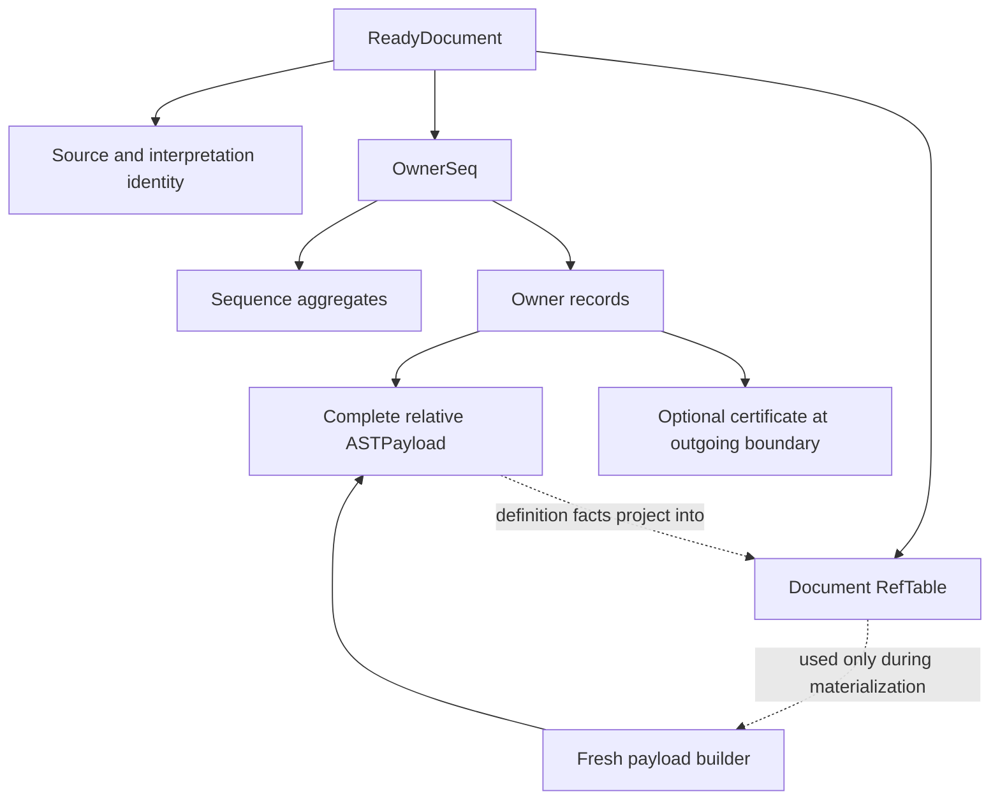
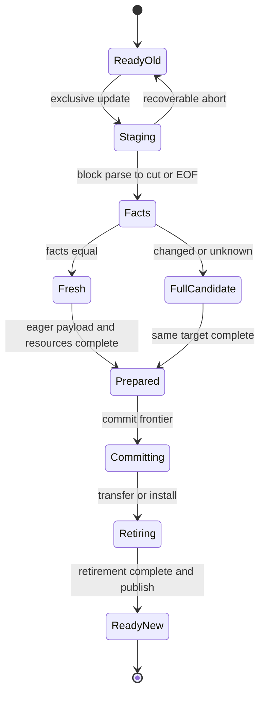

# Markit Horse-A：逻辑数据模型与 A-01—A-05 闭合方案

```text
STATUS = CONCRETE LOGICAL DATA-MODEL CANDIDATE
BASE MASTER = 5984cda65800573977d43e78d99a3a3e7fa1cd49
AUTHOR ASSESSMENT = A-01..A-05 CLOSED BY PROPOSED CONTRACTS
FRESH INDEPENDENT REVIEW = REQUIRED / NOT YET RECORDED
MECHANISM IDENTITY FROZEN = NO
FALSIFICATION CONTRACT FROZEN = NO
HORSE-A IMPLEMENTATION AUTHORIZED = NO
HORSE-A PERFORMANCE COLLECTION AUTHORIZED = NO
PRODUCTION ARCHITECTURE = HOLD
```

日期：2026-09-24。状态：**供 #55 下一轮独立审查的完整设计候选；尚未冻结、尚未授权实现。**

本文设计一份确定的逻辑模型，不实现 Rust，不运行 parser、测试或基准，不冻结性能实验，不设计 A-R / Horse-B / A-P。

**结论：以下模型可以在不引入已延后机制的情况下，闭合五项 P1 设计义务。最关键的选择是：物理首行切分、间隔归左；完整顶层子树作为 Owner；仅在实际共享 parser 证明的 root blank barrier 上认证；先比较完整替换区定义事实，再 materialize；最后跨越不可回退的提交边界。**

为避免空白重新归属造成隐含的接缝重写，本文明确选择一个保守的 restart 规则：普通编辑从命中 Owner 起点之前的安全边界开始，纳入一个未修改的左侧语法保护块。它会多解析一个安全段；这是公开的 Horse-A 成本，不是细粒度 checkpoint，也不是声称最近 restart 总是必要。

## 1. 已核实的权威与证据边界

| 材料 | 本次直接核实结果 | 本文使用方式 |
|---|---|---|
| master | `5984cda65800573977d43e78d99a3a3e7fa1cd49` | 唯一已合并代码基线 |
| #55 正文 | 仍含先 payload 后 facts 的旧顺序 | 本文提供替换文本，不把旧候选当正确答案 |
| #55 首次审查评论 | 明确 P1=5、NOT READY TO FREEZE、允许数据模型设计 | 当前设计 gate；覆盖正文较早的状态措辞 |
| #53 | 演进路线；不授权实现或实验 | 保留三个已知弱点 |
| #56 | 阅读地图；明确非设计权威 | 不据此增加 MVP 状态 |
| PR #54 | 初读 head `d9bcdbdc8f410779a303d5bb3913649414effea6`；随后更新为 `e77f8e1da208fe041625931126096787da64d01d`；base 未变、OPEN/DRAFT | 更新后新增首次审查记录并收紧文档权威；不是 freeze decision |

直接阅读了当前 AGENTS、共享 block parser、inline/RefTable、source/edit/mechanism/work 契约、BENCH-GRAMMAR-v1、NORMALIZED-RESULT-v1、H4 的相关维护路径、canonical synthesis 和首次审查原文。这里不重新宣称完成 H0–H4 原始实验审计，也不把推导出的例子写成已运行的 correctness evidence。

主要证据：

- [master](https://github.com/jnhu76/markit/tree/5984cda65800573977d43e78d99a3a3e7fa1cd49)、[AGENTS.md](https://github.com/jnhu76/markit/blob/5984cda65800573977d43e78d99a3a3e7fa1cd49/AGENTS.md)
- [#55](https://github.com/jnhu76/markit/issues/55)、[首次审查结论评论](https://github.com/jnhu76/markit/issues/55#issuecomment-5816598745)、[#53](https://github.com/jnhu76/markit/issues/53)、[#56](https://github.com/jnhu76/markit/issues/56)、[PR #54](https://github.com/jnhu76/markit/pull/54)
- [固定版本的首次审查记录](https://github.com/jnhu76/markit/blob/e77f8e1da208fe041625931126096787da64d01d/docs/research/reviews/horse-a-first-design-review-2026-09-24.md)
- [shared parser](https://github.com/jnhu76/markit/blob/5984cda65800573977d43e78d99a3a3e7fa1cd49/research/benchmarks/markdown-ast-update/shared-grammar/src/parser.rs)、[inline / RefTable](https://github.com/jnhu76/markit/blob/5984cda65800573977d43e78d99a3a3e7fa1cd49/research/benchmarks/markdown-ast-update/shared-grammar/src/inline.rs)
- [grammar](https://github.com/jnhu76/markit/blob/5984cda65800573977d43e78d99a3a3e7fa1cd49/research/benchmarks/markdown-ast-update/grammar/BENCH-GRAMMAR-v1.md)、[normalized result / query](https://github.com/jnhu76/markit/blob/5984cda65800573977d43e78d99a3a3e7fa1cd49/research/benchmarks/markdown-ast-update/grammar/NORMALIZED-RESULT-v1.md)
- [source](https://github.com/jnhu76/markit/blob/5984cda65800573977d43e78d99a3a3e7fa1cd49/research/benchmarks/markdown-ast-update/common/src/source.rs)、[edit](https://github.com/jnhu76/markit/blob/5984cda65800573977d43e78d99a3a3e7fa1cd49/research/benchmarks/markdown-ast-update/common/src/edit.rs)、[completion boundary](https://github.com/jnhu76/markit/blob/5984cda65800573977d43e78d99a3a3e7fa1cd49/research/benchmarks/markdown-ast-update/common/src/mechanism.rs)、[work counters](https://github.com/jnhu76/markit/blob/5984cda65800573977d43e78d99a3a3e7fa1cd49/research/benchmarks/markdown-ast-update/common/src/work.rs)
- [canonical synthesis / R1–R6](https://github.com/jnhu76/markit/blob/5984cda65800573977d43e78d99a3a3e7fa1cd49/docs/research/markit-31-research-synthesis.md)

本文的 PASS/计数评价的是**本文提出的模型**。它不会自动改变 live #55 的 NO，也不代替下一轮独立审查或正式冻结。

完成前再次核实：master 仍为上述 SHA，PR #54 仍为 `e77f8e1d… / OPEN / DRAFT`，#55 正文仍含旧 materialization 顺序，最后更新时间为 `2026-09-24T14:59:06Z`，已有一条首次审查评论。没有修改仓库、issue 或 PR。

## 2. 固定范围与修正后的概念图

包含：single-version、mutable、byte-weighted retained sequence、root-level certified restart/convergence、owner-relative spans、eager complete semantic payload、same-target full rebuild、local structural splice。

延后：consumer postings、winner index、stable cross-edit IDs、persistent locator map、COW/historical roots/snapshot readers、nested restart checkpoints、任意 container continuation 恢复、packed/chunked representation、高级 cost selector、global reuse index。**NOT IN HORSE-A MVP 不等于 PERMANENTLY REJECTED。**

第一 realization 选定为一 record 一节点的 mutable AVL weighted sequence，以使 split/join 的机制边界确定。这个选择是待证候选，既不是最小性定理，也不是生产结构或性能最优结论。下面先规定语义和操作，再给 explanatory schemas。



箭头中的 facts projection 是一致性关系，不是允许对 AST 和 RefTable 分别修改。已完成 payload 不再向 RefTable 发起语义修复请求。证书属于 Owner 的**右侧 coverage cut**，不是 AST 子节点；aggregates 只属于 sequence。



没有 `Committing → FullCandidate` 边；没有 `no convergence → error` 边。EOF 完成可以直接成为局部替换的右端。

## 3. A-01：唯一 source coverage 规则

### 3.1 定义

设 UTF-8 source 长度为 L，共享 block pass 产出的完整顶层 block 为 `B0…B(k−1)`。`p_i` 是 `B_i` 第一条**物理行的行首 byte offset**，不是它的 semantic span.start，也不是剥掉容器前缀后的列。每个顶层 block 的所有后代属于同一个 Owner。

若 `k > 0`：

```text
c0 = 0
ci = p_i                       for 0 < i < k
ck = L
Owner_i.coverage = [ci, c(i+1))
Owner_i.payload  = complete subtree B_i
```

若 `k = 0 && L > 0`：恰好一个 `TriviaOnly` Owner，coverage `[0,L)`，无 ASTPayload、无 definition facts。若 `L=0`：OwnerSeq 为空，M=0。禁止零长度 Owner，禁止在普通相邻 block 之间再插入 trivia records。

这是**物理首行切分、间隔归左、首块接纳 leading trivia、末块接纳 trailing trivia**的一套规则。没有 block 的全空白文档是唯一 trivia-only 特例，不输出 normalized trivia node。

`p_i` 应由共享 block pass 的物理行 provenance 得到；full builder 可在线记录。局部 builder 只处理实际 fresh block。不得从每个 retained semantic span 反向扫描全文寻找行首。

由严格递增的物理首行和最后的 L，得到：

```text
union coverage_i = [0,L)
coverage_i ∩ coverage_j = ∅, i ≠ j
sum coverage_len_i = L
```

coverage partition 不要求 semantic spans 构成 partition。源中的缩进、LF、标记和 span gaps 都保留在 source 中。

### 3.2 四种边界必须分开

| 概念 | 含义 | 能否据此 restart |
|---|---|---|
| source coverage | Owner 对连续原始字节的完整归属 | 不能 |
| syntax semantic span | frozen normalized vocabulary 为某个节点规定的区间 | 不能 |
| Owner boundary | 两个 coverage record 的切点，或 BOF/EOF | 不能自动推断 |
| restart-safe boundary | Owner boundary 中有本文 §8 证书的子集，另加 BOF | 可以，但仍须检查 edit/支持区关系 |

### 3.3 LF、空白与插入端点

| 情况 | 唯一规则 |
|---|---|
| 一个 block 最后一行的 LF | 归该 Owner，即使不在该 block 的 semantic span 内 |
| block 内部 LF | 仍归同一 Owner；是否属于 Text/span 由 frozen grammar 决定 |
| 两个顶层 block 之间的 blank separators | 全部归左侧 Owner，直到右 block 的物理行首 |
| leading trivia | 归第一 block Owner；它的 relative semantic start 可以大于 0 |
| trailing trivia | 归最后 block Owner，一直到 L |
| 第一行 indentation | 归该 block 的 Owner；normalized span 是否排除它由共享语义决定 |
| container prefixes / 内部 gaps | 归整个 container Owner；不造 trivia AST |
| all-whitespace | 此处指共享语法中的 SPACES/LF-only；TAB/CR 是普通文本，不属于此特例 |
| EOF | 位置 L，不是一个 byte，不归某个零长度 record；末字节仍归最后 Owner |
| 空文档 | 无 Owner；逻辑 Document root `[0,0)`，QUERY(0) 为 `[Document]` |
| byte locate | 对 `0 ≤ x < L`，返回唯一含 x 的 coverage；x=L 返回 EOF sentinel |
| 零长插入 `[a,a)` | 定位 affinity 固定为 RIGHT：a<L 命中右侧/包含 a 的 Owner；a=L 命中 EOF sentinel |
| 非空删除/替换 `[a,b)` | 左端按 RIGHT 定位；最后被移除字节用 b 的 LEFT 视图定位；b 的 RIGHT 视图是可能保留的右邻 |
| block-start 插入 | 当起点是物理行首/Owner cut 时按 RIGHT 命中；仍将左侧安全段纳入重解析，防止 paragraph/container 接缝变化 |
| block-end 插入 | semantic end 不是 ownership end。插在 LF 前通常仍在同一 Owner；插在下个 Owner cut 按 RIGHT；EOF 独立处理 |

RIGHT affinity 只决定旧状态中的 damage 定位，不承诺新增字节最终归右 Owner。最终归属必须由**新 block parse + 同一 coverage 公式**决定。

文档 root 是合成的结果节点，不占 Owner record。NORMALIZED-RESULT 的“节点不为零长”措辞需在 #55 引用时明确为普通非 Document 节点；空 Document 的 `[0,0)` 由 Document `[0,len)` 规则及现有 full-builder 行为决定。FencedCode.content 是另一个允许零长度的区间，但它不是节点。

### 3.4 左侧保护块：使 coverage closure 可执行

对 canonical edit `[a,b) → inserted`：

1. `a<L_old` 时，令 t 为 RIGHT 定位 Owner 的 coverage 起点；`a=L_old` 时 t=L_old；空文档 t=0。
2. 选择最大的 **interior certified boundary r<t**；若没有则 r=0。普通 EOF completion 不作为 restart certificate。
3. `r>0` 时，`[r,t)` 至少包含一个完整、位于 edit 之前的顶层 block。它的起始语法未被编辑。这个保护块可能与后文合并或延伸，但不会凭空消失。因此新 replacement 至少有一个 block，可以接纳其尾部空白。
4. `r=0` 时允许新 replacement 暂时没有 block。若 `[0,q_new)` 仍含字节且后面有保留 block，则 q_new **尚不是 coverage 可切点**：这些 leading bytes 应归第一个 block。继续 parse 至包含该 block 的合法切点或 EOF。
5. `r=0 && q_new=0` 可形成空新中段；原 suffix 的第一 Owner 现在恰从 0 开始。EOF 时无 block 且 L_new>0 则建立唯一 TriviaOnly；L_new=0 则建立空序列。

这样无需把 retained suffix payload 全部重新基址化，也无需在提交时临时制造 gap node。删除 blank line 导致 paragraph merge 时，直到新的完整段落结束才允许切分；paragraph split 则一个旧 Owner 可替换为多个新 Owner。替换数量从来不固定为 1。

此规则故意牺牲最短 restart：一个普通段落内部编辑可能同时重建前一个段落。这项确定成本必须保留在机制身份中。不能在看到测量结果后静默改成另一套 affinity/restart policy。

## 4. ReadyDocument 契约

READY 表示：**当前 source、完整 syntax、完整 inline/semantic values、document RefTable、coverage、相对坐标、证书及必要 aggregates 已全局一致，足以连续接受下一次 edit。**

直接拥有的逻辑对象只有：

- 当前 source 的有效访问权及精确身份关联：SourceId、当前逻辑 revision/operation token、byte length；旧→新的 canonical edit association 由共同 substrate 提供。
- interpretation identity：BENCH-GRAMMAR-v1、NORMALIZED-RESULT-v1、共享 parser/normalization 实现版本、所有影响解释的 options、Horse-A data-model/certificate policy revision。options 即使为空也明确记录其身份。
- 一个 OwnerSeq。
- 一份拥有自身 label/destination 值的 document RefTable。

不在每个 Owner 上盖当前 source version 戳。Owner 属于哪个当前 source，由 ReadyDocument 的归属和替换证明建立；逐 Owner 续签会违反 R3。

全局 coherence：sequence 总字节=L；Owner 顺序对应当前顶层 block 顺序；所有 relative spans 合法；投影等于完整共享语义结果；RefTable 恰为 AST definitions 的 ordered projection；每个 certificate 的归纳前提成立；所有缓存摘要正确。

READY 后禁止 lazy parse、reference re-resolution、未完成 index 构造、query-triggered repair、待偿还 retirement。Text 的内容通过当前 source 上投影后的 span 读取是纯读取；绝对坐标投影和完整 export 也不是延迟语义。

UPDATE 取得独占逻辑访问权。STAGING 中旧 ReadyDocument 完整，内部可读；不提供并行 snapshot reader 或跨 update 的外部 node handle。旧 queries 如果在 staging 内部执行，只能针对旧 source；候选不能被当作 ReadyDocument 查询。

commit 前失败：释放 fresh candidate 和临时资源，旧对象仍完整，逻辑事务可把它还给拥有者；不得留下被部分 split 的旧树。现有 harness 的 `Mechanism::update` 以值消费 old，`Err` 不返回 old；其适配器可在错误退出时显式销毁这个完整旧对象。**本文没有声称现有 public trait 已提供 rollback API。** 异常退出销毁成本归错误生命周期，不能用这种 disposition 代替成功局部 update 的 R5。

commit 开始后旧 representation 不再是一个可用 ReadyDocument：它被独占消费。只有完成新状态安装、全部本轮必要 retirement 后，READY_new 才对外可见。无需保留两个可查询版本。

## 5. Owner 与 ASTPayload

### 5.1 Owner

普通 Owner 的语义是：**一个完整顶层 block syntax subtree + 按 §3 分配的 source coverage + 右侧边界的可选证书。**

巨大 List（含所有 items）、BlockQuote（含所有 nested quotes/blocks）、Paragraph、FencedCode 各保持一个 Owner。Horse-A 不在 container 内建立 retained sequence，也不为 W-A1 分裂 payload。retained granularity 与 safe-boundary granularity是两个集合：有完整 block Owner，不代表它前后都是 root-safe。

Owner 的 coverage_len > 0。普通 payload root 非空；TriviaOnly 无 payload 且只能是整个无 block 文档的唯一 record。metadata/header 和 payload 是逻辑上可分离的职责，但不规定 Box、arena、指针或内存布局。

### 5.2 ASTPayload

ASTPayload 是一个 Owner 在获准的全局环境下已经完成的 normalized subtree。必须有：

- block topology；nested block nodes；有序 inline nodes。
- Heading.level、ListItem.marker、Fence.info、Link.destination、ReferenceLink 的 normalized label 和 resolved destination、Definition 的 normalized label/destination。
- 所有普通 node spans；所有 fenced-code content intervals；统一相对同一个 Owner base。
- Definition nodes 本身承载完整 syntax facts，含 nested definitions 和 duplicates。

不是每个字段都必须采用当前 `Node` 的 optional-field 物理形式，但信息不能少。Text bytes 可由 source/span 唯一得到；不要求复制 source 文本。

shared Skel 的 block kinds、topology、必要 values/span 信息在最终 payload 中存活；**不是继续保留 Skel 对象**。Para.segments、heading content input、ContextKey、OpenPara/OpenFence/container frames、临时绝对 spans 和 materialization scratch 在完成后释放。RefTable 不从 Skel 或 payload 借用字符串；payload 不从 RefTable 借用 resolved destination，不保留对 staging 对象的借用。

已经完成的 payload 不依赖后续 RefTable 查询。RefTable 与它仍须语义一致，但其对象寿命不承担 payload 的存活。source 仅用于纯 source slice 读取；payload 没有指向旧 source 字节地址的隐含 Text 指针。

因此，仅在前面插入字节且该 Owner 语法/语义保留时，它的 payload、relative spans、semantic values 可以 state-for-state 原样保留；只改变通过 sequence prefix weight 算出的绝对 base。不承诺稳定 cross-edit ID 或外部可观察地址。

## 6. Owner-relative coordinates 与查询

```text
base(Owner_i) = sum(coverage_len_j for j < i)
absolute([u,v)) = [base + u, base + v)
0 ≤ u ≤ v ≤ coverage_len_i
```

普通 block spans、所有 nested inline spans、Fence.content 都以同一个 Owner base 为零点，不逐层相对 parent。父子 containment 服从 normalized contract。普通非 Document node `u<v`；空 fenced content `u=v` 合法。顶层 unclosed fence 可结束于 L，包括最终 LF；nested fence 的截断/EOF clamp 完全继承共享 parser，不由 OwnerSeq 另定。

| 操作 | 契约与复杂度 |
|---|---|
| document byte → Owner | weighted seek O(H)，同时返回 base 和临时路径 |
| 已定位 Owner 的一个 span 投影 | O(1)；必须已有本次操作有效的 base，不是只有裸 payload 引用 |
| 跨 edit 保留的裸 node handle | 不支持；读借用不能越过独占 update |
| NODE_PATH_AT(x) | O(H + V_i + depth)，V_i 为该 Owner 内实际搜索节点数；无内部索引时最坏 Θ(payload 节点数) |
| owner coverage trivia | 若不在任何 top-level semantic span 中，只返回 `[Document]` |
| container 内 span gap | 保留所有真正包含 x 的祖先，再停止；不能把所有内部 gaps 都返回为仅 Document |
| EOF | `x=L` 固定返回 `[Document]`；空文档同理 |
| whole-tree export | inorder Owner cursor + running base；O(M + 全部输出节点/值字节)，额外遍历栈 O(H + payload depth) |

NODE_PATH_AT 按半开 containment。查询 offset 不必为编辑的 UTF-8 字符边界；输入契约允许范围内 byte offset，节点端点仍必须为合法 UTF-8 边界。编辑端点则必须通过 canonical edit 的 char-boundary 验证。两种要求不可混淆。

whole export 合成一次 Document root，顺序投影所有 payload；不能对每个 Owner 从根重新 seek，也不能在 export 中 materialize/repair。

## 7. OwnerSeq 操作与持久 aggregates

### 7.1 操作契约

OwnerSeq 是按 source 顺序排列的 mutable balanced sequence。树序与 payload 层级没有同构要求。操作只认 coverage、证书摘要与已验证 cut，不识别 Markdown。

| 操作 | 精确行为 | 成本/限制 |
|---|---|---|
| locate_by_byte(x) | `x<L` 返回唯一 Owner、base、relative offset 和短期路径；x=L 返回 EOF；越界拒绝 | O(H) |
| exact_boundary_lookup(x) | 仅 x=0、x=L 或某个 coverage prefix sum 时成功；返回 cut rank、左右邻接视图、若有则 outgoing certificate | O(H)，不把任意 semantic span.start 当 cut |
| safe_predecessor_lookup(t, strict) | 在持久 interior cert 中找最大 `<t` 或 `≤t`；无结果返回虚拟 BOF | O(H)，利用 has_safe 跳过无证书 subtree；Horse-A restart 使用 strict |
| sequential cursor | 一次 seek 后保持本次操作的路径和 running base；next/prev 不重新从根 seek | k 步合计 O(H+k)，栈 O(H)；结构 mutation 后失效 |
| split(cut) | 消费一棵树，在已验证 record cut 分为两棵；不拆 payload；prefix weights 各自重算 | O(H)，只改变边界/平衡路径；不能 flatten |
| join(left,right) | 消费两棵已按源序相邻、coverage seam 已证明正确的树，产生平衡树 | O(H_left+H_right) 上界；保留内部 subtrees；不检查语法 |
| replace_range(l,r,fresh) | 两次 split + joins，得到 new sequence 和独立 detached old middle | O(H+H_fresh) 结构路径；fresh bulk build 另计；不在此遍历/销毁整个 old |
| total_bytes | 根 aggregate.bytes；空树 0 | O(1) |
| total_records | 根 aggregate.records；空树 0 | O(1) |

split/join 是内部 consuming operators，不能在 staging 时作用于 old。staging 只读定位并准备 cut ranks/path capacities；跨 frontier 后才执行。

### 7.2 每个缓存字段的理由

| 持久字段 | 具体使用者 / 为何不能靠全量重算 | 局部 combine | splice/rotation |
|---|---|---|---|
| subtree_bytes | weighted locate、exact cut、running base、总 coverage | L.bytes + owner.len + R.bytes | 新/变路径更新；子树摘要 O(1) 读取 |
| subtree_records | total_records、cut rank、detached/retained record accounting | L.records + 1 + R.records | 同上 |
| subtree_has_safe | safe predecessor，以及 cursor 跳过无 eligible cert 范围 | L.has_safe OR owner.end_cert.is_some OR R.has_safe | 同上；BOF/普通 EOF 不存在于该位中 |
| subtree_payload_nodes | 已有 nodes_reused 计数要求；不遍历 retained payload 来数节点 | L.nodes + owner.payload_nodes + R.nodes | 同上 |
| height（或等价 AVL balance metadata） | split/join/rotation 的平衡判定 | 1 + max(L.height,R.height) | O(1)，无需 descendant scan |

`owner.payload_nodes` 在 fresh eager materialization 时计算一次；TriviaOnly=0，Document 合成根不计入这个数。`subtree_payload_nodes` 的原因是现有 `work.rs` 把 nodes_reused 当实际计数，H4 已因 retained walk 暴露 R6 问题。此缓存有明确消费者，不是为未来猜测而加的统计。

Horse-A 的 native semantic node 单元需与 block parse events、sequence record events 分开。H4 虽保留 Skel 与 semantic payload 两份表示，但其 `retained_block_nodes` 实际按 skeleton 的 block/container 节点加 semantic tree 的 inline 节点计数，不是把两棵树全数相加。Horse-A 的完整 normalized subtree 节点数可对应这个逻辑单元；sequence record、证书和 allocation 另计。本文不冻结实验指标数值，但禁止省略口径映射。

不持久保留 subtree hashes、absolute base、global generation、definition count、label map、subtree depth histograms、平行 checkpoint Vec。definition extraction 只遍历实际 replacement 的 block topology，所以不需要全树 definition aggregate。

数值溢出在 staging 中用 checked bounds 预先排除；执行 mutation 时不再临时发现 recoverable overflow。空 children 的所有计数为 0。一次 rotation 只读取参与节点及各 child 根摘要；不会为了保留一个 untouched subtree 而访问它的 descendants。
