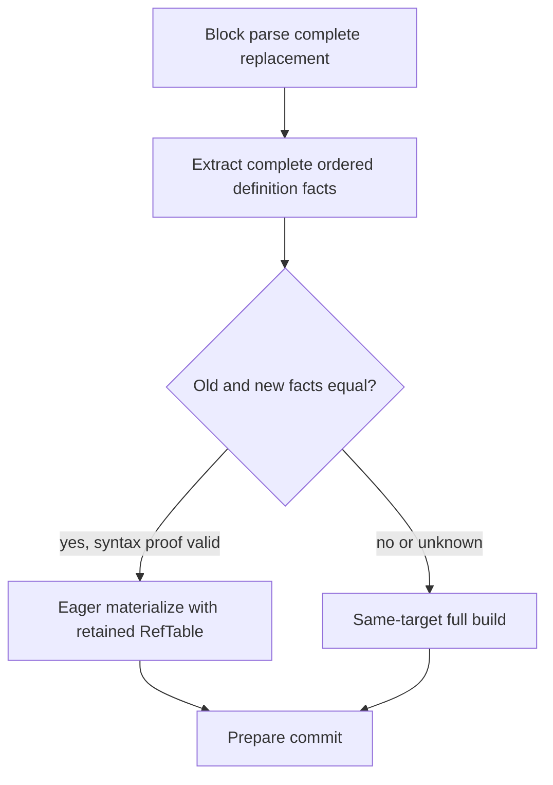

## 8. A-02：RestartCertificate 的精确意义

### 8.1 被认证的命题

对 interior Owner cut q，证书证明：在当前文档的共享 block semantics 中，处理完 q 之前的真实 source 后，**在处理 q 开始的下一物理行之前、并且在任何 EOF finalization 之前**：

```text
frames = empty
open paragraph = none
open fence = none
pending cross-boundary block/output obligation = none
all blocks before q fully emitted
q is an exact coverage cut and a physical line start
the immediately preceding complete physical line is SPACES* LF
that line was actually processed as a root blank barrier
```

只有该命题成立，才能把 q 后的 source 当作空 root 的 block input。定义环境不属于这个 block continuation，稍后独立证明。

MVP 只认证这个保守集合及虚拟 BOF。heading 后、definition 后、closed fence 后若没有 root blank barrier，即使某些位置事实上可以 restart，也**不发证书**。这不是另一套语法，只是允许的恢复点子集。

### 8.2 证据从哪里来

共享 scanner 的真实 state 包括 `frames`、`para`、`fence`；当前 ContextKey 仅含前者及 fence，没有 paragraph。`parse_region` 在 end 调用 finish，因此不能凭其返回时空 state 认证非 EOF 切点。

设计中的 semantic observation 必须由共享 parser 层提供或由其已证明的控制流适配：在正常行步进后/下一行 dispatch 前，确认上面的命题，并携带上一条 raw blank line 的范围。现有实现中 `classify(B1)` flush paragraph，`strip_prefixes` 和 B1 关闭相应 root containers，hook 不在 open fence 时调用；这些是证明依据。`ContextKey::default()` **加上“实际消费的 raw root blank barrier、无段落/待输出义务”证据**才够，单独空 key 不够。

OwnerSeq 不能正则扫 Markdown、推测 container 是否已结束，或从 block kind 猜出证书。若未来 adapter 尚不能暴露足够 evidence，就不得发该证书；BOF 和完整解析仍正确。该接口是语义观察/停点，不是 nested restore API。

### 8.3 支持区与局部有效性

证书存放在左 Owner 的 outgoing boundary，坐标全部相对左 Owner。直接 source support 是：紧邻 q 的完整 blank line `[l,q)`（含终止 LF），以及确定 l 为物理行首的前一 LF（l=0 时为 BOF）。这段 support 不跨过左 Owner 的起点；若某个候选不能满足这个条件，不持久认证它。

还存在**语法 provenance 前提**：这条 line 确实在当前 coherent parse 中按 root blank 被消费，且此前 state 已按共享规则演进。source bytes 本身并不能证明 fence 没开。这一前提通过 ReadyDocument 的正确性和下面的替换归纳维持，不存一份从 BOF 到 q 的依赖列表。

| 场合 | 证书处理 |
|---|---|
| r 在编辑之前，保留的 prefix/source 完全相同 | prefix 中证书继续有效；restart 证书不依赖 r 右侧第一行内容 |
| edit 改变 support 内字节、相关 LF、在 support/接缝端点插入 | 不自动搬用为 new 的证书；接缝重新观察/认证 |
| support 字节未动，但更早编辑可能打开 fence/container | 不能仅凭 support unchanged 推断 new 有效；必须先建立 new live continuation / convergence |
| fresh middle 的边界 | 由本次共享 parse 新建证据 |
| convergence 的 incoming seam | 左边换成 fresh middle；使用本次生成的证书，不保留旧左 Owner 的证书对象 |
| retained suffix 内部边界 | 从已证明的同一 empty-root entry 开始，suffix source 完全相同，确定性 block parse 演进相同；因此内部证书整体继承，无需逐条访问或续签 |
| grammar/options/certificate policy 改变 | 不是普通 incremental edit；same-target full build，不能用旧证书 |

这区分了“old certificate 在 READY_old 中有效”和“可原样迁移到 READY_new”。old 始终到 frontier 前 coherent；但编辑之后不能把所有旧证书当作 new 的事实。

BOF：永远有独立虚拟证据，canonical empty root，不需要一个零长 Owner。EOF：实际 finish 后可以完成结果；**普通 EOF completion 不是供以后 append 使用的 restart certificate**，因为 EOF 可能刚刚强制关闭 paragraph/fence。MVP 不把最后 Owner 的 EOF 边界放进 has_safe。append 必须回到真正 earlier safe point 或 BOF。

### 8.4 必须拒绝的捷径

- `a\nb\n`：第二行开头空 ContextKey 仍有 open paragraph；无证书。
- `> a\n>\n> b`：中间行有 `>`，不是 raw root blank；整个 quote 一 Owner。
- fence body 中的空行：raw bytes；不能发 root certificate。
- paragraph 被 heading/definition/fence 打断：旧语法边界仍可能因 marker 编辑消失；无 blank 就不认证。
- 把某一候选 q 当 `parse_region(..., end=q)` 的末尾再调用 finish：会制造假闭合；禁止。
- 删除 fence delimiter 后，旧 suffix 中的 definitions 可能变成 code body；必须通过 forward parse 才能重新建立 root convergence，不能按未修改文本保留。

## 9. Convergence 与候选发现

设旧长度 L，edit `[a,b)` 替换为长度 u 的 UTF-8 文本，`δ=u−(b−a)`。prefix `[0,a)` 不变；旧 suffix `[b,L)` 与新 `[a+u,L+δ)` 由共同 canonical edit contract 精确关联。不要在热路径重新 hash/比较整个 suffix。

普通 convergence cut `(q_old,q_new)` 必须同时满足：

1. q_old 是 old 中真实的 interior Owner boundary，具有有效 old root certificate。
2. `q_old≥b`、`q_new≥a+u` 且 `q_new=q_old+δ`；插入时绝不能在未消费 inserted bytes 的旧侧 affinity 上提前收敛。
3. 从 r 开始的新 live parse 已处理编辑、语法传播及所有本轮纳入的保护/接缝区；在 q_new 之前完成全部 fresh blocks，没有跨 cut 的 payload。
4. 新 live continuation 独立满足 §8 的 pre-EOF empty-root 命题。不能只比较 ContextKey。
5. suffix mapping 精确；grammar/options 相同。候选 old certificate 的直接 blank/LF support 必须能完整映射到未修改字节；support 被触及的候选保守跳过，继续 parse。即使 support 完好，第4项仍不可省。
6. old/new coverage 在这里都可完整切分，满足 §3.4 的 leading-trivia/空中段规则。特别是新 `[0,q_new)` 只有空白且非空时，不能把它作为中段而保留右侧第一 block。

支持区映射的检查使用区间及 canonical edit geometry；old certificate 已证明其字节内容，不需要重新扫描所有 old 空白。新侧 evidence 随真实 parse 产生。端点 insertion 保守视为可能影响 support，除非当前 mapped source 区间证明它严格位于 support 之外；MVP 不为了多保留一个边界做额外语法特判。

右端 EOF 是独立合法 case：`q_old=L_old, q_new=L_new, S=∅`。在**真实新 EOF**执行正常 finish，完整处理未闭 fence/paragraph/container。不要求 old EOF 有 root cert，也不要求 finish 前新 continuation 为空。没有更早 convergence 不是错误，也不自动重跑 full。

候选发现采用一个 update-local monotone old cursor：

- 在 r/编辑右端附近至多 O(H) 初始化；其短期路径、running byte base 和下一个 eligible boundary 只活在本次 staging。
- 按 parser 实际前进位置推进。每行只比较当前 byte position 与下一个候选；不每行从根 seek。
- 只在 parser 已越过对应位置时推进旧 cursor；成功处立刻停止。跳过整个不可用 subtree 可用 has_safe/byte weights；不预生成候选 Vec。
- 所访问的旧 Owner 顺序范围位于最终被替换区，最多加常数个边界邻接；保留在成功 convergence 之后的 suffix 不枚举。
- 因而顺序发现成本可界为 O(H + Δ_old + Q)，不是无条件 O(Q)。若实现选择每个候选 exact seek，须如实记 O(QH)，不能仍报告此 cursor 界。

新 parse 始终以真实 L_new 为合法 EOF。若使用现有 hook 跳到 L_new 以停止扫描，必须已经证明 live empty root，最多生成一个 transient suffix placeholder，且从 fresh-middle materialization 中剥离它。placeholder 不成为 Owner，不进入定义事实或最终 AST。也可以用共享 parser 的证据停点返回 sealed block region；两者必须满足同一观察/完成契约，不引入另一套 block parser。

本候选不设置 learned selector，也不设置需要 fence 内每行回调保证的增量预算：正常推进至第一个合法 convergence 或 EOF。语义证明失败走 full，资源错误在 frontier 前 abort。若将来增加预算，须另行明确实际中断点及最大不可中断跨度并修订候选；不能用当前 hook 宣称任意 fence 内可及时取消。

## 10. RefTable 与 A-03：先 facts，再 materialization

AST Definition nodes 是 syntax facts；RefTable 是这些 facts 的 document-wide semantic projection/query environment。它们可拥有重复的 derived strings，但只有一条来源关系：

```text
RefTable.entries = source_order_projection(all AST ReferenceDefinition nodes)
resolve(label) = first matching entry's destination, or absent
```

表没有可独立修改的 API 语义。READY 时表和 AST 一致；UPDATE 要么整个保留表，要么新 full builder 产生完整新表。没有局部表 patch、winner index 或 consumer postings。

共享 RefTable 当前保存完整 ordered `(normalized_label, destination)` 序列，含重复定义，resolve 是线性 first-match。值不含 absolute positions、Owner IDs 或 node pointers，因此定义位置移动而同序 facts 相等时表可原样保留。

### 10.1 精确替换区

```text
old source/syntax = P · O · S
new source/syntax = P · N · S
O covers [r, q_old)
N covers [r, q_new)
```

其中 r/q 都经过 coverage closure。O/N 包括左保护块、真正传播过的全部 blocks、nested definitions、duplicates，以及 fence/container 变化隐藏或暴露的 syntax。它们不是原始 `[a,b)`，也不是最初定位到的一个 Owner。

`Defs(O)` 从将被 detach 的旧 payload 的 **block topology** 源序遍历获得；不扫描 unrelated P/S，不遍历没有定义可能性的 inline descendants。`Defs(N)` 从 shared block pass 的 fresh region definitions 或等价有序 Skel.Def projection 获得。在从 EOF/placeholder 结束时必须证明事实恰好属于 `[r,q_new)`，不含跳过的 suffix。

两个 streams 精确比较规范化 label 和 destination 字节，保留顺序和 duplicates；不比较 node identity、absolute coordinates，不排序、不去重，不比较只有 winners 的集合，不仅比较 hash。不必长期保存第三份事实索引。

### 10.2 替换引理

在 P/S 的 block 解释、fact 顺序已由 restart/convergence 证明不变时：

```text
Defs(old) = Defs(P) ++ Defs(O) ++ Defs(S)
Defs(new) = Defs(P) ++ Defs(N) ++ Defs(S)
Defs(O) == Defs(N)  =>  RefTable_old.entries == RefTable_new.entries
```

因此每个 label 的 first-wins 查询结果相同；旧 P/S eager payload 可保留；N 可使用旧表完成语义。

不等或提取完整性不能证明，只意味着 **preservation unknown / conservative full rebuild**。不能据此输出“effective winner definitely changed”。例如改动 shadowed destination 必须 full，虽然 winner 可能未变。

### 10.3 唯一允许的顺序



不得先按旧表 materialize 新 reference-sensitive payload，再把“可能修正”留给之后。full path 也必须先得到全局最终表再跑 inline。

旧 replacement fact extraction 可能遍历整个巨大 block；实际 fresh reference lookup 可能每次扫描 D 个定义。这是实际被处理语法/语义的成本，须独立报告，不能用 structural O(H+Δ) 掩盖，也不能据此偷偷加入 winner index。

## 11. A-04：staging、commit frontier 与 retirement

### 11.1 Staging 中必须完成的工作

old ReadyDocument 由事务独占拥有，但其 sequence、payload、RefTable、source association 全部未改。fresh source 由共同 substrate 提供；它与旧 source 的临时共存不等于 historical AST/COW。

在跨 frontier 前完成：

1. 验证 input identity、canonical edit/UTF-8/range、grammar/options；计算安全的长度差和总计数上界。
2. 只读定位 cuts、选 r、运行 parser、确定 q/EOF 和 coverage closure。
3. 提取/比较完整 O/N facts，选择保留环境或 full candidate。
4. 完成 fresh eager payload、全部 relative spans、coverage lengths、新证书、payload-node counts、fresh sequence bulk build。
5. 在构造过程中验证 fresh 局部不变量；利用 old 已有 invariants + substitution proof 验证合成关系。不为“验证总正确性”额外扫描 P/S。
6. 预建结果容器、sequence 操作 workspace、边界路径容量、所有需要的新结构节点；检查累计 byte/record/node counts 溢出。
7. 预备 retirement workspace 与不会失败的统计/事件输出容量；结束所有指向 old payload/table 的 staging 借用。
8. 得到唯一 `PreparedCommit`：要么 `Splice{cuts,fresh}`, 要么 `ReplaceAll{complete_new}`。此时没有未决算法分支。

cut plan 使用本次 old state 的临时 rank/路径，不是 stable locator。old 在 staging 不变，因此不会过时；mutation 后不复用原 cursor。split/join 内如需后续路径重算，使用已保留容量，不追加 recoverable allocation。

retirement 若使用显式栈，必须预先有足够容量：可从待删除区的 record/payload-node 摘要得到保守上界；range measure 用两条边界路径组合，O(H)，不扫描 retained P/S。也可选择已证明不分配的 destructive drain。本文要求可独立转移/销毁的逻辑能力，不规定其 allocator 或最终 Rust lifetime 技巧。workspace 峰值必须计入，不能称为免费。

**不允许**使用“整棵旧树的生命周期绑定于一个不可分解 arena，因此局部更新后把所有旧 allocation 永久留下”的实现。若布局无法独立转移 untouched forest 和退役 detached state，它不满足本 logical contract；不是用 Rc/COW 兜底的理由。

### 11.2 唯一 frontier

frontier 是事务从 `PreparedCommit + coherent old` 转入消费 old ownership 的瞬间。之后要求 no allocation、no recoverable validation、no parser/fact decision、no fallback。所有操作前提已在 staging 确立。

逻辑顺序：

```text
consume Ready_old wrapper
split old sequence at r and q_old -> P, detached O, S
move fresh N into position
join P, N, S with local aggregate/balance repair
move RefTable_old into new wrapper       [preserved case]
install post-source association
destroy detached O and every obsolete transient
release old source association when last needed borrow is gone
seal and expose READY_new
```

这段是所有权顺序，不要求具体指针/布局或为每一步创建一个 heap 对象。未变 P/S 的树链接可因平衡改变，内部 payload/Owner state 不逐条搬运。旧 wrapper 失效，但转移走的 P/S 永远不进入旧 wrapper 的全树 destructor。

full case 则安装已完成的独立新 target，detach 整个 old sequence/table/source association，退役全部 old。full 的 global cost 合法且必须明记。

### 11.3 各对象何时释放

| 对象 | preserved-environment splice | full rebuild |
|---|---|---|
| old P/S | ownership 转入 new；不销毁 | 全部销毁 |
| old O | detach 后完整销毁，含真实 removed payload 和证书 | 随全部 old 销毁 |
| old RefTable | 按所有权移动，entry 值原样保留 | 在旧/临时借用全部结束后释放；new 拥有新表 |
| old source association | 切换后、所有 staging/source reads 完成后释放 | 同左 |
| post source | new 持有有效访问权 | 同左 |
| fresh Skel / input segments / local facts | materialization/比较后可提前销毁；最迟 complete 前全部退休 | 放弃 attempt 的资源也须销毁并计费 |
| cursors / path plans / drain workspace | commit/retirement 后释放 | 同左 |

RefTable 与 payload 不借用旧 source，因而不会为留住一个 String 指针而保留旧文档。共享 substrate 若仍持有 old source，其最终回收由 substrate 的共同边界承担；Horse-A 必须计入自身 handle release，不能谎称实际 source 内存已经释放。不能私自把 source copy/hash 放进或移出某个 lane；沿用共同 source 契约并明确边界。

retirement 在 complete 返回 READY_new 前完成。把 detached middle 排到后台、移到下次 update、留给 export 或“将来再 drain”不满足 R5。commit 中的逻辑 bug / process OOM 不是 fallback，不能给出虚假的 rollback 保证。

## 12. 同目标 full builder 与 BUILD/UPDATE 逻辑算法

### 12.1 Full builder

```text
shared full block pass over exact source
→ complete ordered document RefTable
→ eager materialization under that final table
→ canonical Owner coverage construction
→ convert every span and content interval to owner-relative coordinates
→ attach restart certificates from real pre-EOF parse evidence
→ balanced OwnerSeq bulk build and all required summaries
→ internally complete ReadyDocument candidate
```

coverage 所需的 physical-line starts、certificate 所需的 live evidence，可以在 block pass 在线采集后于组装时使用；上述顺序不是许可等 parser 被销毁后，从空 ContextKey 倒推证书。

空文档、TriviaOnly、Document synthetic root、spans、RefTable、queries 和后续 update 能力与 incremental path 完全相同。full builder 不输出一个较弱的“只有 normalized tree、没有 sequence/certificates”的 target。树的具体平衡形状、allocation 地址及短期 identities 可以不同；同一 source 的逻辑 Owners/coverage/payload/可认证边界集合和查询结果应相同。

bulk build 对已排序 M 个 fresh Owners 一次构建平衡树和 summaries，结构组装 O(M)；不逐个 O(log M) 插入再声称 O(M log M) 是这类结构不可避免的 build cost。parse 与 inline 的成本不由这条 O(M) 覆盖。

full path 是正常正确退路，但不是免费退路。记录：放弃的 incremental attempt、fresh full block/RefTable/payload/sequence 构建、old+new source/retained state 同时存活峰值、临时 Skel/facts/workspace、全部 old retirement。

若本次已经从 BOF block-parse 到真实 EOF，可直接利用这份完整 block result 生成新全局表并 full materialize；不必重跑相同 block pass。否则本文的简单 full policy 是释放 attempt，再 clean full block build。无论复用还是放弃，都记真实发生的工作。

现有 H0 的 timing 是另一种 native target 的 timing。H0 可继续作为 normalized correctness oracle；不能把它直接当成 `HorseA::full_build` 的成本，更不能拿 update 对 H0 的时间比证明同目标经济性。

### 12.2 完整 UPDATE 伪算法（非 Rust 实现）

```text
begin exclusive transaction holding coherent READY_old
validate source identities, grammar/options, canonical edit and arithmetic
locate a with fixed RIGHT affinity; derive anchor t
r := strict certified predecessor of t, else BOF
parse post source from r toward true EOF
    discover old candidates lazily with one monotone cursor
    accept first candidate satisfying every convergence and coverage clause
    otherwise finish at real EOF with empty suffix
extract Defs(old[r:q_old)) and complete Defs(new[r:q_new))
if syntax substitution is valid AND ordered facts exactly equal:
    materialize all fresh blocks with old document RefTable
    form relative payloads, canonical Owners, certificates and summaries
    pre-create every commit/retirement resource; validate local composition
    cross frontier
    transfer P/S structurally; splice N; retire only O and obsolete transients
else:
    build complete same-target full candidate with final document RefTable
    pre-create retirement/install resources; cross frontier
    install full candidate; retire complete old and abandoned attempt
release obsolete source associations and all mandatory transients
publish one coherent READY_new
```

input/资源 failure 在 frontier 前 abort；syntax invariant violation 应报告实现错误，不能靠 full fallback 隐藏。“事实完整性无法证明”可 conservative full；“旧 ReadyDocument 自己已经不满足契约”不是正常 fallback condition。

## 13. A-05：R1–R6 的 scoped contract 与执行者

共同作用域：**禁止仅为定位、保留、重坐标、认证、计数或退役未受影响 retained state 而做与其规模成比例的维护。** 不禁止真实 syntax replacement、长 parser propagation、真实 semantic fanout、removed payload、显式 full rebuild、whole-result export 或 document destruction。每类工作都留在其声明边界内。

| 要求 | 本模型的准确规则 | 哪个不变量/操作落实 | 仍允许且必须计费 |
|---|---|---|---|
| R1 | edit coverage 与 certified predecessor 不全表扫描 | bytes/has_safe summaries；weighted locate；strict predecessor | 所选 r 可能很远；R 是真实 parse work，不是 O(H) |
| R2 | 不为保留 P/S 逐 record clone/reinsert | consuming split/join/replace_range；独立 forest ownership | 边界/AVL path、fresh records、实际 removed records |
| R3 | 不逐 suffix 改 absolute positions/cert generation | 全部 relative spans；相对 certificate support；suffix induction | fresh boundary、changed support、seam 及 aggregate path 的修复 |
| R4 | environment-preserved 分支仅用完整 O/N facts 与 syntax proof | replacement lemma；旧 block-only traversal；新 parser facts stream | inequality/unknown 的保守 full；fresh lookup 的线性 D 成本 |
| R5 | 只退役 detached superseded state | frontier 后 P/S 先转移；detached O 独立 drain；complete 前完成 | 全部 removed payload；full rebuild 与 document close 的全量 destruction |
| R6 | 必须的计数来自实际事件及 summaries | subtree_records、subtree_payload_nodes；构建/解析/转移事件 | pure oracle/export/diagnostic traversal 可全量，但不补 native work |

不要把“语义环境实际没变”写成“Horse-A 必须总能低成本识别它没变”。Horse-A 只承诺本地**充分证明**。shadowed definition edit 的保守 full 是 W-A2；固定无定义局部 witness 随 M 增大自动 full 则仍不能算 structural PASS。

同样，不把 extra guard block 的解析归入“retained maintenance”来规避报告；它是本候选明确选择的实际 replacement/parser work。不得用不断扩大 replacement 的方式把原本全表维护改名为“changed work”而宣称局部性。对固定短段落 witness，所选 guard/restart/convergence 范围必须确实独立于 M；此项留待正式 falsification contract。
