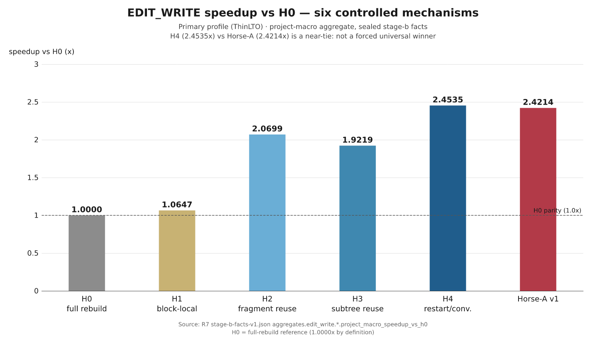
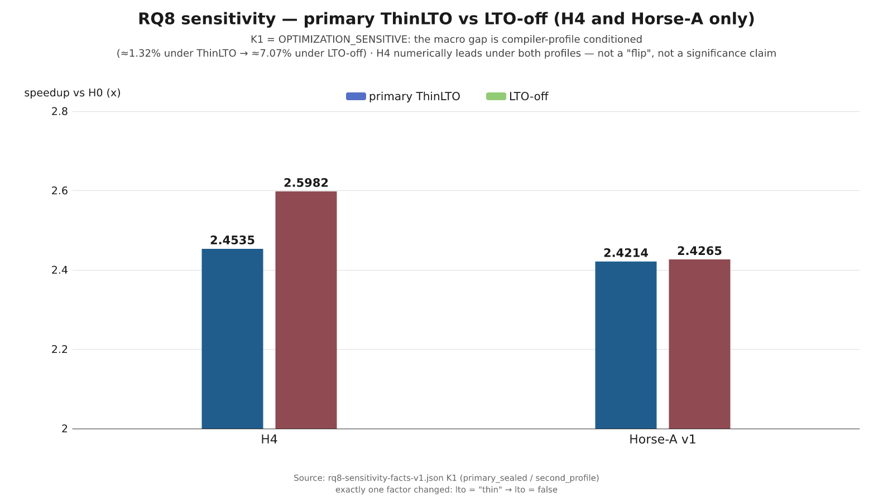
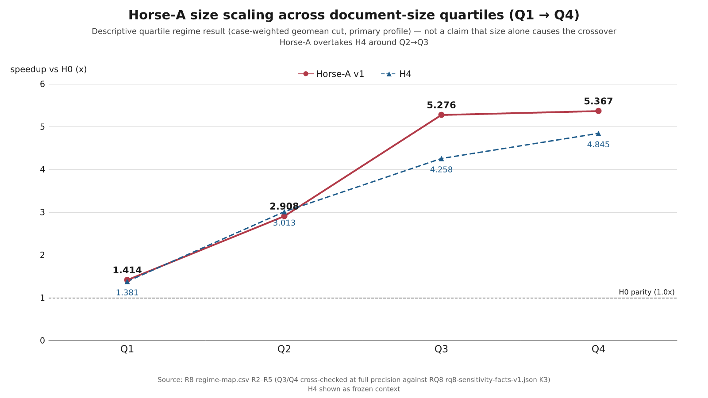
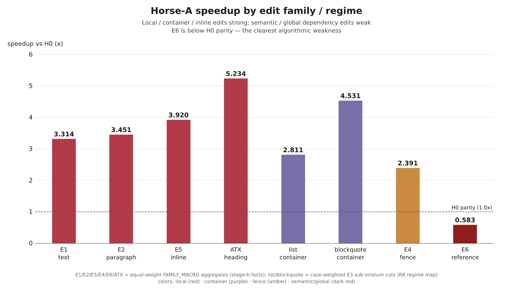
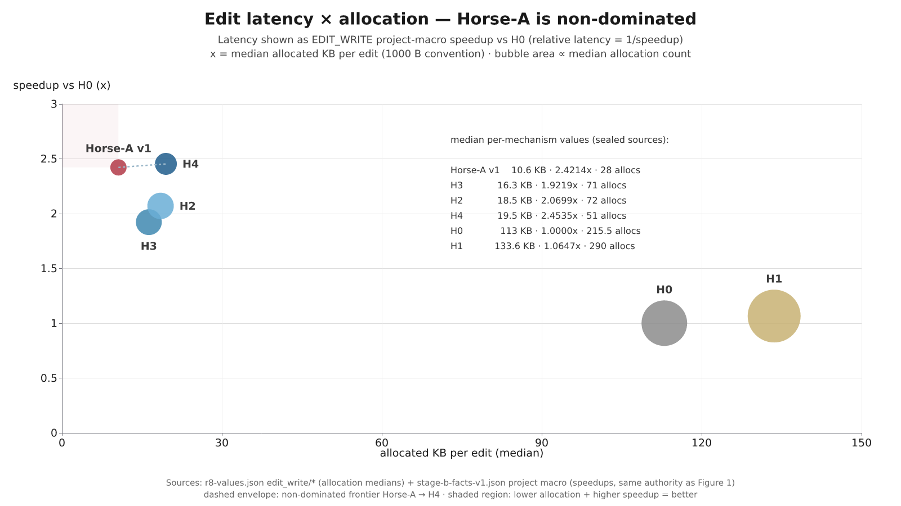
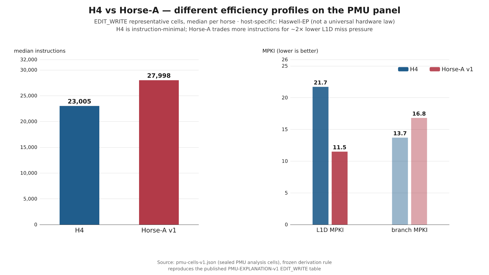
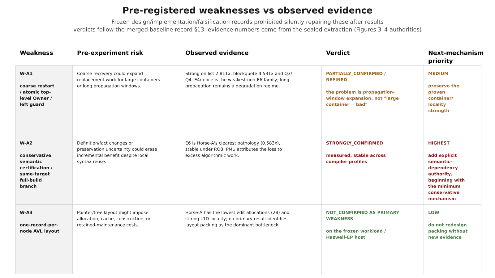
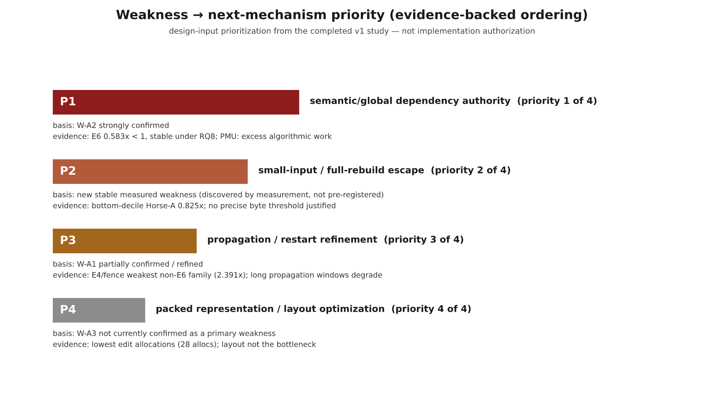

# Horse-A v1 baseline experimental record

> Issue: [#91](https://github.com/jnhu76/markit/issues/91)  
> Study authority: [#33](https://github.com/jnhu76/markit/issues/33) CLOSED / COMPLETE; [#76](https://github.com/jnhu76/markit/issues/76) CLOSED / COMPLETE  
> Status: **Horse-A v1 immutable experimental baseline**  
> Production Markdown-editor implementation: **NOT STARTED**

## 1. Purpose

This document is the human-readable baseline record for the completed Markit
R0–RQ8 Markdown AST update-mechanism study. It freezes what the study actually
measured about H0–H4 and Horse-A v1 before any next-generation Horse-A / Markit
mechanism is designed or implemented.

It exists so that future work can answer two separate questions without
rewriting history:

1. Were the original Weakness Map and Design Decision Matrix conclusions
   genuinely supported by the frozen evidence?
2. Does a future Horse-A v2 / next mechanism repair the measured weaknesses
   without destroying Horse-A v1's measured strengths?

Horse-A v1 is therefore an immutable experimental subject. Future mechanism
work must use a new mechanism identity rather than silently changing what
"Horse-A" meant in this study.

---

## 2. Subjects and claim boundary

The controlled comparison contains six mechanisms:

| ID | Controlled mechanism |
|---|---|
| H0 | full rebuild reference |
| H1 | block-local reparse |
| H2 | fragment reuse |
| H3 | old-tree subtree reuse |
| H4 | restart / convergence |
| Horse-A | retained structural ownership + locality-oriented incremental update |

The comparison is scoped to the frozen BENCH-GRAMMAR-v1/common Rust substrate,
common Source/Edit/result contract, frozen workload, common correctness oracle,
and common measurement discipline. Prior-art names provide mechanism lineage;
these results are not product-level latency claims about upstream parsers.

The completed study used four sealed evidence layers — the primary campaign's
T/A/M lanes plus the PMU explanation campaign — and one second-profile
sensitivity qualification applied on top of them:

```text
T-LANE  -> wall-clock timing
A-LANE  -> algorithmic / structural work attribution
M-LANE  -> allocation / retained-memory evidence
PMU     -> targeted microarchitectural explanation
RQ8     -> second compiler-profile optimization sensitivity
           (qualification, not a collection lane)
```

Key sealed counts:

```text
primary T/A/M observations = 555,264
qualified failures         = 0
retries                    = 0

PMU observations           = 3,168 / 3,168 QUALIFIED
PMU failures/retries       = 0 / 0

RQ8 sensitivity rows       = 202,800
RQ8 failures/retries       = 0 / 0
unstable sessions          = 0
```

---

## 3. Durable evidence authority

The complete R0–RQ8 record is preserved as one self-contained research capsule.
The host path is operational metadata; the durable identity is the filename
plus full SHA-256.

```text
BASELINE_CAPSULE = markit-r0-rq8-research-record-v1.tar.gz
BASELINE_CAPSULE_SHA256 = 156ec1f3fbdfe1759ce81d17940360c2cda3adb773e7be7634b1ccc1e893d849
ARCHIVE_SIZE = 75,718,788 bytes
UNCOMPRESSED_SIZE = 1,485,746,492 bytes
FILE_COUNT = 1,818
```

Current formal-host delivery location:

```text
/home/jnhu/markit-research-archive/
├── markit-r0-rq8-research-record-v1.tar.gz
├── markit-r0-rq8-research-record-v1.tar.gz.sha256
└── README-COPY-TO-OFFSITE.txt
```

The archive includes the sealed primary T/A/M raw data, R7 analysis, PMU raw
and analysis, R8 synthesis, RQ8 sensitivity raw and closure, Horse-A structural
locality evidence, prior diagnostic records, analysis/verification scripts,
environment and binary provenance, issue/PR authority exports, and a complete
Git bundle.

Verification status:

```text
SOURCE_EVIDENCE_VERIFICATION = PASS
SHA256SUMS                    = PASS
MANIFEST                      = PASS
GIT_BUNDLE_VERIFY             = PASS
GIT_BUNDLE_CLONE_SMOKE        = PASS
ARCHIVE_ROUNDTRIP_BYTE_IDENTITY = YES
MISSING                       = none
```

Two other host locations are supporting working/source locations, not the final
capsule identity:

```text
~/markit-r0-rq8-capsule-build/
    unpacked staging tree + verification logs

~/Source/markit*/research/.../results/
    original sealed evidence, unchanged
```

A documented historical erratum is retained in the capsule README: the older
#31-era freeze receipt's Cargo bindings match the #31 freeze commit rather than
the current tree; the authorized evolution/rebinding chain is preserved rather
than silently rewritten.

---

## 4. Primary EDIT_WRITE result

Project-macro H0-relative speedup under the primary profile:

| Mechanism | Speedup vs H0 |
|---|---:|
| H0 | 1.0000× |
| H1 | 1.0647× |
| H2 | 2.0699× |
| H3 | 1.9219× |
| H4 | **2.4535×** |
| Horse-A | **2.4214×** |

### 4.1 How to read `speedup`

The study defines H0-relative speedup as:

```text
speedup S = T_H0 / T_mechanism
relative latency = 1 / S
```

Therefore `2.4214×` does **not** mean that latency was reduced by 242.14%.
It means Horse-A completes the frozen EDIT_WRITE project-macro workload in
about `1 / 2.4214 = 41.3%` of H0's latency — a latency reduction of about
`58.7%` relative to H0.

Primary-profile conversion:

| Mechanism | Speedup vs H0 | Relative latency vs H0 | Latency interpretation |
|---|---:|---:|---:|
| H0 | 1.0000× | 100.0% | baseline |
| H1 | 1.0647× | 93.9% | 6.1% lower |
| H2 | 2.0699× | 48.3% | 51.7% lower |
| H3 | 1.9219× | 52.0% | 48.0% lower |
| H4 | **2.4535×** | **40.8%** | **59.2% lower** |
| Horse-A | **2.4214×** | **41.3%** | **58.7% lower** |

The same conversion makes the Horse-A regime results easier to interpret:

| Horse-A regime | Speedup vs H0 | Relative latency vs H0 | Latency interpretation |
|---|---:|---:|---:|
| Q1 | 1.414× | 70.7% | 29.3% lower |
| Q2 | 2.908× | 34.4% | 65.6% lower |
| Q3 | 5.276× | 19.0% | 81.0% lower |
| Q4 | 5.367× | 18.6% | 81.4% lower |
| E1 local text | 3.314× | 30.2% | 69.8% lower |
| E2 paragraph split/merge | 3.451× | 29.0% | 71.0% lower |
| E5 inline delimiter | 3.920× | 25.5% | 74.5% lower |
| ATX-related | 5.234× | 19.1% | 80.9% lower |
| list container | 2.811× | 35.6% | 64.4% lower |
| blockquote container | 4.531× | 22.1% | 77.9% lower |
| E4 fence | 2.391× | 41.8% | 58.2% lower |
| E6 reference definition | **0.583×** | **171.5%** | **71.5% higher / slower** |
| bottom-decile Horse-A | 0.825× | 121.2% | 21.2% higher / slower |
| POST_HOC tiny extreme | 0.453× | 220.8% | 120.8% higher / slower |

For `S < 1`, the mechanism is slower than H0. This is why Horse-A's E6
`0.583×` is a genuine pathology rather than a small speedup: it corresponds to
roughly `1.715×` H0 latency, or about **71.5% higher latency**.

These percentages are algebraic restatements of the frozen speedup values,
not new measurements or a new aggregation surface.

Under the primary ThinLTO profile, H4 and Horse-A differed by only about 1.3%.
The primary result therefore did **not** justify forcing a universal winner;
the correct primary verdict was first-tier / inconclusive ordering.

This primary near-tie was later qualified by RQ8 (§5).



---

## 5. RQ8 optimization sensitivity

RQ8 changed exactly one compiler-profile factor:

```text
primary:   lto = "thin"
secondary: lto = false
```

All other material build/toolchain conditions remained fixed, including
Rust/Cargo 1.97.1, opt-level 3, codegen-units 1, incremental=false,
panic=unwind, target-cpu=default, empty RUSTFLAGS, allocator policy, machine,
workload, mechanism code, timing semantics, and K1–K6 shortlist.

Macro result:

| Profile | H4 | Horse-A | Gap |
|---|---:|---:|---:|
| primary ThinLTO | 2.4535× | 2.4214× | ~1.32% |
| LTO-off | 2.5982× | 2.4265× | ~7.07% |

Observed profile response:

```text
H4      ≈ +5.9%
Horse-A ≈ +0.2%
```

Therefore:

```text
K1 = OPTIMIZATION_SENSITIVE
```

The correct conclusion is not "Horse-A and H4 are universally tied" and not
"one universally wins". Both are high-performing first-tier mechanisms in the
frozen study, but the macro separation is compiler-profile conditioned.

The other shortlisted conclusions remained stable:

```text
K2 tiny-document crossover          = STABLE
K3 Q3/Q4 Horse-A advantage          = STABLE
K4 E6 semantic/global pathology     = STABLE
K5 clean-state construction cost    = STABLE
K6 H1 fallback lesson               = STABLE
```



---

## 6. Horse-A size regime

Horse-A H0-relative speedup by document-size quartile (case-weighted geomean
descriptive cut over the frozen population, not the project-macro aggregate):

| Size regime | Horse-A speedup |
|---|---:|
| Q1 | 1.414× |
| Q2 | 2.908× |
| Q3 | **5.276×** |
| Q4 | **5.367×** |

Primary data place the Horse-A/H4 crossover around Q2→Q3. RQ8 retained the
same directional size-regime result while reducing the magnitude of the
Horse-A advantage:

```text
Q3 Horse-A advantage:
  primary  +23.9%
  LTO-off  +15.8%

Q4 Horse-A advantage:
  primary  +10.8%
  LTO-off   +3.0%
```

This supports a regime claim — Horse-A becomes especially strong when local
work can be amortized across larger retained documents — but it does not
justify a universal byte threshold or a stronger causal claim that document
size alone mechanically causes the crossover.



---

## 7. Edit-family / regime behavior

Representative Horse-A H0-relative results (E1/E2/E5/E4/E6/ATX rows are
equal-weight FAMILY_MACRO aggregates; the list/blockquote rows are
case-weighted E3 sub-stratum cuts):

| Edit family / regime | Horse-A speedup |
|---|---:|
| E1 local text | 3.314× |
| E2 paragraph split/merge | 3.451× |
| E5 inline delimiter | 3.920× |
| ATX-related case | 5.234× |
| list container | 2.811× |
| blockquote container | 4.531× |
| E4 fence | 2.391× |
| E6 reference definition | **0.583×** |

The important result is not one global leaderboard but a regime split:

```text
local / container / inline edits
    -> Horse-A strong

reference/global semantic dependency edits
    -> Horse-A pathological
```

E4/fence is Horse-A's weakest non-E6 family in the frozen summary, consistent
with propagation-window sensitivity, but not evidence that containers in
general are a Horse-A weakness.



---

## 8. E6: the clearest Horse-A v1 algorithmic weakness

E6 REFERENCE_DEFINITION is the strongest negative result for Horse-A v1:

```text
Horse-A = 0.583× H0
```

Damage-local mechanisms fail in the same direction:

```text
H1 ≈ 0.633×
H4 ≈ 0.647×
```

while H2/H3 remain around full-rebuild parity or slightly above it:

```text
H2 ≈ 1.10×
H3 ≈ 1.03×
```

RQ8 preserves the direction:

```text
damage-local range = 0.596–0.677 < 1
H2 = 1.137×
H3 = 1.072×
K4 = STABLE
```

PMU explains the loss as **algorithmic work volume**, not poor CPU execution.
The slow E6 mechanisms execute roughly 5× the instructions of H2/H3 while
retaining reasonable IPC and low miss behavior. The mechanism is spending too
much work because local structural damage authority does not adequately model
cross-document semantic dependency invalidation.

This is the highest-confidence Horse-A v2 design input.

---

## 9. Tiny-document fixed-cost crossover

Horse-A's incremental machinery does not always amortize.

Frozen evidence includes:

```text
bottom-decile Horse-A ≈ 0.825× H0
POST_HOC extreme      = 0.453× H0
```

In the extreme explanatory cell, Horse-A executes about 10.9k instructions
while H0 full rebuild executes about 6.4k. The incremental prepare/mapping
machinery costs more than rebuilding the tiny input.

RQ8 keeps this conclusion stable (`K2 = STABLE`). The study therefore supports
a **small-input/full-rebuild escape regime**, but it does not support inventing
a precise byte threshold from the existing population.

This weakness was discovered by measurement; it was **not** one of the three
pre-registered Horse-A weaknesses.

---

## 10. Clean-state cost

Incremental representations pay state-construction cost before edits begin.
Horse-A's clean/state build is inexpensive among the incremental mechanisms,
but H0 remains the natural full-construction reference winner.

RQ8 preserves this result:

```text
primary incremental/H0 range   = 0.739–0.793
secondary incremental/H0 range = 0.746–0.804
K5 = STABLE
```

The design implication is a lifecycle distinction, not a mandate to optimize
Horse-A's edit structure away:

```text
initial/open build path != incremental edit path
```

---

## 11. Allocation / resource profile

EDIT_WRITE median allocation profile:

| Mechanism | Allocation count | Allocated bytes |
|---|---:|---:|
| Horse-A | **28** | **10.6 KB** |
| H3 | 71 | 16.3 KB |
| H2 | 72 | 18.5 KB |
| H4 | 51 | 19.5 KB |
| H0 | 215.5 | 113 KB |
| H1 | 290 | 133.6 KB |

Horse-A therefore does not obtain its edit-latency result by paying the highest
allocation cost. In the frozen comparison it is non-dominated on the combined
edit-latency/allocation view.



Peak-memory interpretation remains limited: the observed ~6.5 MB peak is
strongly affected by the harness floor and does not justify a per-mechanism
"lowest peak memory" claim.

---

## 12. PMU explanation: Horse-A and H4 reach the first tier differently

The PMU campaign does not establish a universal hardware law; it explains the
selected frozen observations on the Haswell-EP host.

Representative macro profile:

```text
H4:
  ~23.0k median instructions
  instruction-minimal profile
  L1D MPKI ≈ 21.7

Horse-A:
  more instructions than H4
  L1D MPKI ≈ 11.5
  branch MPKI ≈ 16.8
```

Horse-A's structural locality produces materially better L1D locality on this
host, while H4 executes fewer instructions. These are different efficiency
profiles rather than evidence that either mechanism dominates every regime.

Other PMU findings constrain interpretation:

```text
LLC MPKI ≈ 0 on the measured panel
```

so the study does not support a DRAM/bandwidth explanation. Likewise, IPC does
not track latency ordering monotonically: incremental mechanisms usually win by
**doing less algorithmic work**, not by making every instruction faster.

The branch-heavy Horse-A signature is a measured Haswell-EP characteristic,
not presently the principal Horse-A latency weakness and not a first-priority
v2 optimization target.



---

## 13. Pre-registered Horse-A weaknesses vs observed evidence

Horse-A deliberately preserved three known weaknesses before treatment
performance was observed. The frozen design/implementation/falsification
records explicitly prohibited silently repairing them after seeing results.

```text
W-A1 = root-only restart + atomic top-level Owner + conservative left guard
W-A2 = facts differ OR preservation unknown -> same-target full build
W-A3 = one Owner per AVL node
```

The completed study allows those predictions to be evaluated against evidence:

| Weakness | Pre-experiment risk | Observed evidence | Verdict | Next-mechanism priority |
|---|---|---|---|---|
| **W-A1 — coarse restart / atomic Owner / left guard** | Coarse recovery could expand replacement work for large containers or long propagation windows. | Horse-A is strong on list (`2.811×`), blockquote (`4.531×`) and Q3/Q4; E4/fence is the weakest non-E6 family and long propagation remains a degradation regime. | **PARTIALLY_CONFIRMED / REFINED**. The problem is propagation-window expansion, not "large container = bad". | **MEDIUM**; preserve the proven container/locality strength. |
| **W-A2 — conservative semantic certification / full-build branch** | Definition/fact changes or preservation uncertainty could erase incremental benefit despite local syntax reuse. | E6 is Horse-A's clearest pathology (`0.583×`), stable under RQ8; PMU attributes the loss to excess algorithmic work. | **STRONGLY_CONFIRMED**. | **HIGHEST**; add explicit semantic-dependency authority, beginning with the minimum conservative mechanism. |
| **W-A3 — one-record-per-node AVL layout** | Pointer/tree layout might impose allocation, cache, construction, or retained-maintenance costs. | Horse-A has the lowest edit allocations and strong L1D locality; no primary result identifies layout packing as the dominant bottleneck. | **NOT CONFIRMED AS A PRIMARY WEAKNESS** on the frozen workload/host. | **LOW**; do not redesign packing without new evidence. |

This table is a central research result: the next mechanism should follow the
measured Weakness Map, not simply continue optimizing the concerns that seemed
plausible before measurement.



---

## 14. Pre-registered vs post-measurement discoveries

These provenance classes must remain separate to avoid hindsight bias.

### Pre-registered / frozen before performance

```text
W-A1 coarse restart / atomic Owner / left guard
W-A2 conservative semantic certification / full-build branch
W-A3 one-record-per-node AVL layout
```

### Discovered or materially sharpened by the completed study

```text
tiny-document fixed-cost crossover
compiler-profile sensitivity of the H4/Horse-A macro near-tie
Horse-A branch-heavy PMU signature
Q3/Q4 size-regime crossover behavior
Horse-A E6 attribution-vocabulary gap
```

In particular, the tiny-document crossover must not be retroactively described
as a pre-registered prediction.

---

## 15. Horse-A v1 final characterization

Horse-A v1 is not a universal winner. Its evidence-backed profile is:

### Strengths

```text
strong local incremental performance
large-document advantage
strong container/local/inline regimes
structural and L1D locality (Haswell-EP PMU)
lowest edit-path allocation profile
Q3/Q4 leadership in the frozen study
```

### Weaknesses / limitations

```text
E6 semantic/global dependency pathology
small-input fixed-cost crossover
clean-state retained-representation construction tax
branch-heavy Haswell-EP signature
incomplete Horse-A-specific E6 work-attribution vocabulary
H4/Horse-A macro near-tie characterization is optimization-sensitive
   (the gap magnitude is profile-conditional; H4 numerically leads under
   both profiles — the winner sign does not flip)
```

The strongest design lesson is:

> structural locality alone is not a complete incremental-semantics authority.

A mechanism can be excellent at preserving local structure yet lose badly when
an edit changes document-global semantic relationships.

---

## 16. Evidence-backed next-mechanism priorities

The completed v1 study provides design inputs, not authorization to implement a
production Markdown editor.

Current evidence-backed ordering:

```text
P1 semantic/global dependency authority
   <- W-A2 strongly confirmed

P2 small-input/full-rebuild escape
   <- new stable measured weakness

P3 propagation/restart refinement
   <- W-A1 partially confirmed/refined

P4 packed representation / layout optimization
   <- W-A3 not currently confirmed as a primary weakness
```

A first next-mechanism hypothesis should try to preserve Horse-A's ownership,
locality, and low-allocation strengths while eliminating the E6/global
semantic failure and pathological tiny-input fixed cost. A complex dependency
index is not automatically justified: the existing evidence only establishes
that explicit semantic-dependency authority is required; it does not yet prove
that a large permanent reverse-dependency structure is worth its maintenance
cost.

Likewise, the current evidence does not justify making branch MPKI, AVL packing,
or cache micro-tuning the first optimization target.



---

## 17. Future v1 vs v2 comparison contract

Any next-generation Horse-A study must record at least:

```text
BASELINE_MECHANISM = Horse-A v1
BASELINE_CAPSULE = markit-r0-rq8-research-record-v1.tar.gz
BASELINE_CAPSULE_SHA256 = 156ec1f3fbdfe1759ce81d17940360c2cda3adb773e7be7634b1ccc1e893d849
```

A future mechanism must use a new identity. Its first targeted falsification
should answer:

1. Does E6 recover toward full-rebuild parity?
2. Does a legitimate small-input escape remove pathological losses?
3. Are E1/E2/container/E5 and Q3/Q4 strengths preserved?
4. Are low allocation and locality advantages preserved?
5. Can semantic/global work now be attributed explicitly?
6. Does any W-A1 refinement improve propagation regimes without harming local
   container cases?
7. Is there any new evidence that actually justifies revisiting W-A3 layout?

The first v2 experiment should be targeted. A complete 555k-row campaign and a
new PMU campaign are not automatically required before the candidate survives
these falsification checks.

---

## 18. Figure/table plan and provenance rule

The baseline report should eventually include at least:

1. six-mechanism EDIT_WRITE speedup vs H0;
2. Horse-A Q1→Q4 size scaling;
3. selected edit-family/regime speedups;
4. latency × allocation Pareto view;
5. H4 vs Horse-A PMU efficiency profile;
6. ThinLTO vs LTO-off sensitivity;
7. pre-registered W-A1/W-A2/W-A3 vs observed evidence;
8. Weakness → next-mechanism design-target matrix.

Final figures must not be produced from hand-copied prose numbers. The required
provenance is:

```text
sealed raw / derived CSV or JSON
    -> deterministic extraction / plotting script
    -> figure artifact
    -> this baseline report
```

This requirement exists because independent review already found transcription
slips during the study. The prose is interpretation; sealed derived artifacts
are the plotting authority. The 2026-09-29 evidence audit applied the same rule
to this document: the §4 H2/H3 macro values are the exact 4-decimal roundings
of the sealed stage-b facts (2.0699 / 1.9219), replacing the zero-padded
2.0700 / 1.9220 forms inherited from the #91 snapshot.

**Status (2026-09-29): all eight figures are generated and wired in.** The
provenance rule above is fulfilled by
`scripts/research/horse-a-v1-baseline-figures/`: committed sealed-input
copies verified against the capsule's own SHA256SUMS, a deterministic
extraction with frozen-value guards, and ECharts rendering — see §21 and
[figures/horse-a-v1-baseline/README.md](figures/horse-a-v1-baseline/README.md).
The numeric tables in this document remain the readable baseline summary;
the committed sealed inputs remain the plotting authority.

---

## 19. Threats and interpretation boundaries

The baseline must retain these limits:

- the comparison is a controlled mechanism study under BENCH-GRAMMAR-v1, not a
  product benchmark of Lezer, Tree-sitter, markdown.mbt, or other upstream
  systems;
- PMU explanations are host-specific to the measured Haswell-EP environment;
- RQ8 shows that at least one macro ordering conclusion is compiler-profile
  sensitive;
- Q3/Q4 leadership is a stable regime observation, but the exact mechanical
  cause of the crossover remains incompletely isolated;
- Horse-A E6's weakness is measured and PMU-attributed to work volume, but its
  internal A-LANE vocabulary does not fully decompose that work;
- post-hoc extreme cells explain anomalies and must not be promoted as
  population-wide frequency claims;
- the study does not establish a precise small-file fallback threshold.

---

## 20. Baseline status

```text
R0–RQ8 STUDY                    = COMPLETE
PAPER-STYLE STUDY               = COMPLETE
HORSE-A v1 EVIDENCE             = SEALED
RESEARCH CAPSULE                = VERIFIED
HORSE-A v1                      = IMMUTABLE BASELINE
RQ8 K1 MACRO NEAR-TIE           = OPTIMIZATION_SENSITIVE
RQ8 K2–K6                       = STABLE
PRODUCTION DESIGN IMPLEMENTATION = NOT STARTED
```

This document is the research bridge from the completed Horse-A v1 study to a
future evidence-driven next-mechanism design cycle. It does not itself freeze
or authorize Horse-A v2.

---

## 21. Generated figures and provenance

The eight figures referenced in §4–§16 are generated by a deterministic,
docs/scripts-only pipeline:

```text
scripts/research/horse-a-v1-baseline-figures/
    inputs/          sealed derived artifacts copied verbatim from the
                     verified R0–RQ8 capsule (see inputs/PROVENANCE.md);
                     SHA256SUMS entries are the capsule's own
    lib/extract.mjs  extraction + frozen-value guards (fails closed)
    lib/charts.mjs   ECharts option builders (display only)
    lib/render.mjs   ECharts SSR SVG -> resvg -> PNG (1600x900, white)
    generate-all.mjs one command regenerates everything
```

Per-figure source mapping, transformations, full-precision plotted values,
and PNG hashes are recorded in the generated manifest:

```text
docs/research/figures/horse-a-v1-baseline/manifest.json
docs/research/figures/horse-a-v1-baseline/README.md   (provenance summary)
```

The extraction re-verifies every input SHA-256 against the capsule's manifest
entries at generation time and asserts the frozen baseline values (§4 macros,
§6 quartiles, §7 families, §11 allocations, §12 PMU medians, §5 K1) before any
PNG is written; drift aborts the run. Figures 7–8 restate §13/§16
qualitatively and plot no numeric value that is not injected from the sealed
extraction used by Figures 1–4. Reruns are byte-identical. Regenerate with:

```bash
cd scripts/research/horse-a-v1-baseline-figures && npm install && npm run generate
```