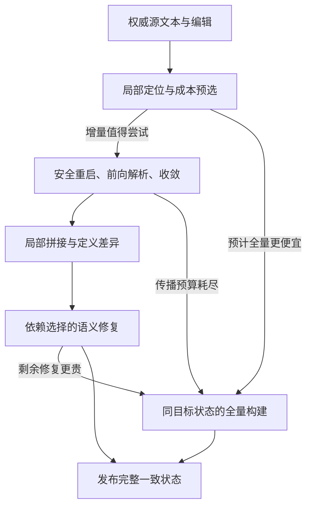

# Markit AST 解析与更新：证据驱动的算法设计候选 v0

Status: **RESEARCH DESIGN CANDIDATE — NOT PRODUCTION ARCHITECTURE**

交接 issue：[ #48 — Campaign-2 机制综合与 AST 算法设计](https://github.com/jnhu76/markit/issues/48)。

本文件是用户要求的后续模型交接设计。它把 Campaign-2 结论转化为数据表示、算法步骤、正确性义务与小范围验证计划。它允许后续设计者质疑候选结构，并要求用相同语义和成本边界说明替代方案。

配套阅读：

1. [Campaign-2 完整机制评审](campaign-2-mechanism-synthesis.md)：数字、原始计数、置信度、证据限制。
2. [从实验到 AST 的实施指导](campaign-2-to-ast-guidance.md)：设计目标和工程顺序。
3. 本文：具体算法约束、状态预算、接口与验收。

## 0. 权威、范围与状态

### 0.1 证据身份

权威一律指向**已合并的 master 权威**，不指向临时 PR head：

```text
机制与计数权威          PR #46 merge  3762b7a42e1c284a4c2c2e0ebac8496e70c63431
Campaign-2 证据权威      PR #47 merge  334eea6201fc0258e35a7c5b21feb722641ddcbd
H0-H4 correctness parity PR #30 merge  12952a561c79fa051bca6bae7409ef536cd43011
H4 大 N 根因证据权威     PR #51 merge  6cec47e9bb756affb0a4477bcb4962c3c78d8901
```

补充说明：

- Campaign-2 的 A–J 解读是在 PR #47 的审查 head
  `819928966e05ca00bb82c58b887014e54f3d0cd5` 上完成的；该 head 以历史
  provenance 的身份出现在
  [campaign-2-mechanism-synthesis.md](campaign-2-mechanism-synthesis.md)
  与 [docs/research/README.md](README.md) 中（该历史文档内的链接也固定到该
  head）。本文其余引用一律使用上表的 merge SHA，不使用该 head。
- 补充 raw：用户提供的 `research/31-campaign-2-review-inputs` 两个 archive；
  本次取得提交 `7f2cdb2`。
- #45 不作为研究权威；#21、Experiment 0、归档 markit-core 不因本文重新生效。
- 本次评审结论：`CAMPAIGN_2_ANALYSIS_USABLE=YES`，候选综合 `MODIFY`。
- 本文已被 #50 / PR #51 的证据**扩展**（而非推翻）：Campaign-2 的 §C4 假设
  （H4 的全局表示维护税不可收窄为 suffix relocation）后来被量化为多条 O(M)
  retained-state 流；见
  [markit-31-research-synthesis.md](markit-31-research-synthesis.md) §4–§5。
- 本文仍不等于生产设计已证明；`V1_DATA_STRUCTURE = UNDECIDED`。

这是当前 #22/#31/#33 研究链的证据综合与算法设计候选。现有 `AGENTS.md`、产品 source-truth/losslessness 等不变量继续适用。本文不修改 `docs/product/architecture.md` 的 HOLD，不为 UI、渲染、线程模型、插件 ABI 或生产 parser 实施授权。用户本轮明确要求完成 issue 归档和详细设计；实际代码与测量属于后续明确工作范围。

### 0.2 两层语义范围

**研究原型**严格使用 BENCH-GRAMMAR-v1、NORMALIZED-RESULT-v1 与现有 oracle。先保持语义核心不变，隔离表示和更新算法的影响。BENCH-GRAMMAR-v1 的 LF、空白、引用等规则均按其实际规范执行；不能顺手换成 CommonMark 规则。

**未来产品**还需要独立冻结目标 Markdown 方言及其 oracle。本文不把该 benchmark 子集指定为产品语言，也不声称完整 CommonMark/GFM 支持。每增加语法特性，必须重新检查 continuation、依赖和边界规则。Source Mode、Live Mode、preview/print 从同一源文本派生；渲染不进入 parser critical path。

### 0.3 决策等级

| 等级 | 含义 | 本文例子 |
|---|---|---|
| REQUIRED | 正确性或用户产品不变量 | source 权威、精确语义、发布一致性 |
| EVIDENCE-SUPPORTED | 观测与源码支持的设计方向 | 去除全文候选枚举、避免 eager suffix rebase |
| PROPOSED | 可以具体实现、尚待验证的选择 | mutable chunk sequence、block 粒度 consumer index |
| OPEN | 本次不足以决定 | chunk 宽度、持久化、嵌套 restart 密度、产品方言 |

后续模型不能把 PROPOSED/OPEN 写成“实验已经证明”。可以替换候选结构；必须保留它所承担的正确性和成本义务。

### 0.4 陈述分级（A/B/C/D）—— 每条主要陈述的可追踪分类

上一节的四级与本节四类一一对应，但本节是**逐条陈述**的分类表。
读本文时，任何一条陈述都应落在下列四类之一；不属于任何一类的陈述不应被引用。

```text
A. REQUIRED_BY_CORRECTNESS
   违背它得到的就是错误结果，与性能无关。不能被“更快”交换掉。

B. SUPPORTED_BY_EVIDENCE
   由仓库内的证据权威支持的设计方向。仍然只是方向：
   它约束“必须去除什么工作”，不指定“用什么结构”。

C. CANDIDATE_DESIGN_CHOICE
   可以具体实现、尚待验证的选择。可以被替换，但必须保留它承担的
   正确性(A)与成本(B)义务。

D. OPEN_QUESTION
   现有证据不足以决定。必须显式保留为开放项，不得默默选一个。
```

#### A. REQUIRED_BY_CORRECTNESS

| 陈述 | 位置 | 检查方式 |
|---|---|---|
| 编辑后的规范化结果 == clean full parse | §7、§14 I3 | oracle normalize equality |
| source 是唯一文本真值，非编辑区字节不变（losslessness） | §4.1、§5、§14 I1 | source edit + 版本/hash fixture |
| coverage 恰好无重叠无遗漏地分割 `[0, source_len)` | §4.2、§14 I2 | 覆盖区间与 length sum 检查 |
| restart 必须携带完整可恢复的 parser continuation（含未完成 paragraph / container / fence 状态） | §8、§14 I4 | 重启结果与对应 clean suffix 的语义一致性测试 |
| convergence 必须**证明** continuation 等价，不能凭 node kind / hash / `nodes_reused>0` | §9.1、§14 I5 | 强制关闭 reuse 的反事实对照 + 边界 fixtures |
| definition winner 遵循源顺序与冻结 normalization（含 duplicate / shadowed） | §7、§11.3、§14 I6 | duplicate/undefined fixtures |
| 任何可受有效 label 变化影响的 retained owner 都可被发现（**含 unresolved 引用尝试**） | §11.2、§14 I7 | 依赖全扫描 oracle 对照（仅验证 lane） |
| 删除 owner 后无悬挂 postings / locator | §4.4、§14 I8 | index consistency checks |
| 发布时 syntax / semantic / source version 一致；不暴露半完成状态 | §10、§14 I9 | eager result/query checks |
| UTF-8 字节坐标与半开区间；编辑必须在字符边界 | §5 | 非法边界拒绝测试；CJK/emoji fixtures |
| 语义修复必须在发布前完成，不得推迟到读取时 | §6、§10、§11.4 | 读接口不得触发 reference resolution |

**比较有效性义务（不是 A 类）**：下表这一条之所以不属于
REQUIRED_BY_CORRECTNESS，是因为违背它不会产生错误结果，只会让新 horse 与
H0–H4 的比较失去意义（AGENTS.md §7 benchmark integrity）。它是测量契约，
必须满足，但它的失效模式是“结论无效”，不是“文档错误”。

| 陈述 | 位置 | 检查方式 |
|---|---|---|
| full path 与 incremental path 构建**相同** ready-state 类型与语义对象 | §7、§12.2、§16 | 两条路径的 state 结构一致性检查 |

#### B. SUPPORTED_BY_EVIDENCE

下表 `R1`–`R6` 是 **V1 行为要求**；`protocol/R0`–`R7` 文件是研究阶段记录，
两者编号无关（分别写作 “V1 requirement R2” 与 `protocol/R7-…`）。

| 陈述 | 证据权威 |
|---|---|
| R1 局部编辑不得要求 O(M) damage / restart search | #50 P1；`damage_records_visited = M`（PR #51） |
| R2 未变 prefix/suffix 不得仅为保留而逐块重走 | #50 P3 = 20.2%、P5 = 21.5%（P5 在冻结证据中是整体，没有 suffix/fresh 数值拆分，不引用“半个 P5”）+ `prefix_slots_visited = M/2`、`suffix_slots_visited = M/2 − 1`（PR #51） |
| R3 未变 suffix 状态不得要求逐记录 slot/checkpoint/ContextKey 重建 | #50 P6（PR #51） |
| R4 未变语义/定义环境不得要求全语法遍历才能发现它没变 | #50 P4 + Adefs；Campaign-2 F 轴（PR #47） |
| R5 局部编辑不得强制 O(M) 退役整个 retained representation | #50 P7 + Adrop/T_drain（PR #51） |
| R6 attribution/statistics 不得在热路径内要求 O(M) retained-tree walk | frozen source `lib.rs:511,606` + 诊断副本采样（PR #51） |
| restart + convergence 是应当保留的主语法机制 | Campaign-2 H4 的 N/B/K/lifecycle（PR #47） |
| full rebuild 必须是正常候选与 escape（cost-selected） | Campaign-2 D/F/global-semantic regime（PR #47） |
| syntax validity 与 semantic validity 必须分开判断 | H2 的 structural/semantic/rematerialization 分离；C-F（PR #47） |
| 更新路径内不得反复枚举全局 old-top-level 候选 | H2/H3 的 consult + candidate Vec 热点（PR #47）；R6 |
| 不得为保留 suffix 而立即逐条重写其绝对坐标 | H1 的 suffix 坐标重建；H4 的 slot/checkpoint 重建（PR #47、PR #51） |
| D 名义值不等于实际收敛距离；`nodes_reused>0` 不代表 suffix take | Campaign-2 C-D 与 H4 计数（PR #47） |

#### C. CANDIDATE_DESIGN_CHOICE

| 陈述 | 位置 | 替代时必须保留 |
|---|---|---|
| 可变平衡 chunk sequence 作为最小原型表示 | §4.3 | 按 byte weight 定位、record 边界 split/concat、未变 suffix 不平移 |
| B-tree / 其他平衡 interval sequence | §4.3、§20 | 同上；并实测其常数与摊还性质 |
| relative coordinate scheme（块内相对 span + 上层聚合） | §4.2、§5 | coverage 精确分割；绝对位置按需派生 |
| `BlockId` + leaf/slot locator（而非每 ID 全树路径） | §4.4 | locator 维护与解析成本计入 U |
| 单当前版本、受控 mutation（暂不引入 persistence/COW） | §4.3、§10 | fallback 能从 post_source 全量重建 |
| certified top-level boundaries 作为首版 checkpoint 粒度 | §8、§15 | 安全边界证明；R 成本公开计入 |
| label -> 按源顺序的 definition occurrences | §11.1 | winner 删除后仍能找到后继 |
| label -> consumer owner blocks（含 unresolved；去重到 block） | §11.2 | 低 F 时不做全文 probe；索引税必须报告 |
| semantic owner 粒度 = block / top-level container | §11.2、§20 | owner 内部重做的成本公开 |
| 分层实现：V1 只有局部 definition facts，V2 才启用 consumers | §11.4 | 两个新增状态组件各自可被否证 |
| 预算型 cost selector（少量工作系数 + 尝试上限） | §12.2 | 不硬编码 C-F 交叉点；不靠 O(N) 预测 |
| `ChangeSummary` 作为内部候选（非稳定外部协议） | §6 | 不把 BlockId/Arc 暴露为插件契约 |

#### D. OPEN_QUESTION

| 问题 | 位置 | 什么证据触发决定 |
|---|---|---|
| retained sequence 的最佳表示（chunk tree vs 其他） | §4.3、§20 | 操作访问/分配与 C/U/内存的实测差异 |
| chunk 宽度 / 分裂合并规则 / fanout | §4.3、§20 | 同上 |
| construction tax 与常驻内存代价 | §16、§17 S0 | 新原型的 C 与 retired-state 计量 |
| pointer-chasing 与 cache 行为 | §16 | 大 N 实测；不得沿用旧 horse 的 cache 结论 |
| persistence / COW 是否需要 | §4.3、§20 | 明确快照读者及其生命周期需求 |
| checkpoint 密度（含嵌套容器 restart） | §8、§20 | R 成本与记录成本的局部比较；K/B 区间收益 |
| dependency index 是否值得其构建/内存税 | §11.4、§20 | low-F 净收益与索引税；否则删除该快速路径 |
| 每 label occurrence 的布局（有序 vector vs 树） | §11.1、§20 | duplicate-heavy 压力是否成为实际瓶颈 |
| cost selector 的策略与参数 | §12、§20 | 误选损失是否足以要求更复杂模型 |
| 产品 Markdown 方言与完整 CST | §0.2、§20 | 产品语义契约与消费接口的明确需求 |
| 首次 full parse 能否更快 | §1、§16 | 本阶段证据不支持；需要独立工作 |

设计目标是**行为要求**，不是某一实现：

> 一个机制，其更新工作与实际语法/语义损伤及 restart/convergence 距离成比例，
> 同时未改动的 retained state 被保留而不承担逐记录维护。

**不得**把本文读成 “Markit is a persistent B-tree parser”，也不得把 §4.3 的
第一候选当作已获证的选择。下一阶段的比较必须让新 horse 与 H0-H4 在相同
semantic core、oracle、payload/edit contract、workload 与 measurement protocol
下竞争；把候选结构当成前提会使该比较循环化。

## 1. 目标、非目标与性能契约

目标：在精确语义下，使用较少持久状态，使局部编辑的解析、发现、坐标维护和语义修复都尽量局部；广泛改变时能够经济地全量重建。

三个独立指标面：

```text
C = initial parse + ready-state construction
U = prepare + syntax update + semantic repair + publish + retired-state release
L(K) = K edits chained through the actual retained state
```

Campaign-2 的 source edit materialization 在 U 外。新原型必须同时声明其同口径 U 和 source edit/query/export 的成本；若 source 每次全量复制，不能宣传端到端 O(local)。完整规范化导出可以 O(output)，但不得借此推迟本应在 complete 前完成的语义修复。

不以 H0–H4 排名、复用百分比或单个最大加速比为优化目标。不预先建立通用片段表、第二棵复用索引树、全语义依赖 DAG、编辑历史预测模型、后台懒语义或并行调度器。

## 2. 证据到决策的可追踪映射

| ID | 证据 | 设计含义 | 尚未证明 |
|---|---|---|---|
| E1 | H1/H4 真实局部编辑约 53.256→4 μs，parse 区域很小 | 局部损伤＋保留昂贵结果有价值 | 任意编辑都局部 |
| E2 | H4 C-N 固定 138 post bytes，但 metadata 随 M 增长；**#50 已把它量化为多条具体 O(M) 流** | 解析局部性必须扩展到状态维护 | 具体 tree 布局/大小最优 |
| E3 | H2/H3 反复候选枚举、clone/drop 热点 | 无全局旧树搜索的边界寻址 | 所有线性算法都比 H0 慢 |
| E4 | H2 低 F 保留大多数 payload；F 增大后退化 | syntax validity 与 semantic validity 分离 | 当前 C-F 已经测出 O(F) 修复 |
| E5 | H1/H4 定义变化退回全量；H2 仍广泛 probe | label 级依赖是值得验证的附加状态 | 索引一定节省总成本 |
| E6 | K0→1 fresh blocks 1→258 | top-level 恢复有粗粒度成本 | 全嵌套 checkpoint 必须加入 |
| E7 | 广泛损伤、失败尝试使 H0 更经济 | full builder 是正常路径和 escape | N/F 的通用固定 crossover |
| E8 | 128 步状态字段无累积漂移 | 暂无证据要求复杂历史治理 | 长期 heap/碎片问题不存在 |
| **E9** | **#50：publish/parse work 恒定（1 block、2 nodes、283 total / 138 unique bytes，8/8 cells），但每次更新仍执行多条 O(M) retained-state 流** | **R1-R6 是必须被具体消除的工作，而不是“换成树”就能消失** | **是否存在同时满足 R1-R6 且保持语义与 fallback 的表示** |
| **E10** | **#50：16 MiB 时唯一 fundamental phase P2 = 0.02% of U_PHASE；三条 O(M) 重建流合计 68.3%** | **设计对象是表示维护，不是 parser** | **新表示的 cache/内存行为** |
| **E11** | **#50：`CACHE_CAPACITY_AMPLIFICATION = STRONGLY_SUPPORTED`（关联），`PRECISE_STALL_DECOMPOSITION = UNRESOLVED`** | **先消除不必要工作，再评估 cache 行为；不要用旧 horse 的 cache 结论预判新结构** | **新机制是把非线性消除还是只是移动** |

E9–E11 的证据权威是 PR #51 merge `6cec47e9bb756affb0a4477bcb4962c3c78d8901`，
不是任何中间 head。

特别禁止两种错误归因：C-D 名义轴值不等于真实 D（当前 H4 全部到 EOF）；H4 `nodes_reused>0` 不代表 suffix take（也可能只有 prefix）。profiling 是定性辅助，不能给出本次纯 U 的可信 IPC 或时间百分比。

## 3. 总体组织



语法处理与 inline/reference 处理使用同一语义核心。full 与 incremental 构建相同 ready-state 类型；区别在于输入范围与旧结果保留方式。不能让 full path 省掉下次更新所需索引，再与完整增量状态直接比较。

## 4. 数据表示：一个源真值，一个可更新结果

### 4.1 概念类型（不是冻结 Rust 布局）

```text
DocumentState {
    source_version
    source_view                   // 权威 buffer 的借用/句柄，无重复全文
    blocks: WeightedBlockSequence
    definitions: Label -> OrderedDefinitionOccurrences
    consumers?: Label -> ConsumerBlockSet
    local_stats_and_budget_parameters
}

BlockRecord {
    block_id                      // 原型内部稳定身份
    coverage_len                  // 含本 record 拥有的 trivia/gap
    relative_syntax               // 语法节点位置相对所属 block
    semantic_payload              // 已完成的 inline/reference 结果
    safe_boundary_context
    definition_facts              // 只含此块/子树拥有的事实
    consumed_labels?              // 包括 unresolved，便于删除 postings
    aggregate_metrics
}

DefinitionOccurrence {
    owner_block_id
    relative_source_range
    normalized_label
    destination
}
```

结构可合并字段，语义与语法不要求各存一棵完整树。最低要求是能够在保留块结构时重新执行该块的 inline 逻辑。具体保留 token、内容区间或轻量 skeleton，由所需操作和内存核算决定。

source、gap 与相对 span 共同保留原始字节。AST 本身无需增加 whitespace 节点。所有 marker/trivia 都有源位置依据；不通过 AST round-trip 重写用户 Markdown。

### 4.2 Coverage 与 semantic span 必须分开

顶层 sequence 的 coverage 必须无重叠、无遗漏地覆盖 `[0, source_len)`；semantic node span 仍服从 NORMALIZED-RESULT-v1，可以不包括行尾 LF 和前导缩进。

这是避免 H3 类问题的硬条件：删除 32 B 的定义行，不能只在 31 B semantic span 上夹断 delta，然后丢失剩余 1 B。edit mapping 由 source coverage 定义，不能从某个 AST node span 的长度猜测。

首部/尾部空白、空文件、只有 trivia 的文件均需有明确 coverage 策略。可由 block record 拥有相邻 gap，或由 sequence 存 gap entries；选择一种并保证所有 split/concat 操作一致。不得同时重复计算 gap。

### 4.3 第一候选：可变平衡 chunk sequence

选择它作为最小原型候选，是因为本阶段只要求一个当前版本。叶子保存有界数量 records，内部节点汇总 byte length；需要时增加 newline count、record count、definition count。

必须真正提供：

- 以 byte weight 查找覆盖 record；
- 在 record 边界 split / concat 或等价 range replace；
- 未变 suffix 不平移、不复制、不重新登记 checkpoints；
- 前后边界的单调 cursor；
- 只在改变路径/边界 chunks 上更新聚合量。

普通“树形容器”不自动满足 split/concat 成本；把 suffix 逐个 reinsert 仍可能线性。实现前写出各操作访问哪些节点。chunk 宽度、分裂/合并规则、内存布局和摊还条件是待确定项。

如后续实际要求保留并发读快照，再比较 COW/persistence；不要为不存在的历史版本需求先增加 Arc 到每个节点。共享 payload 与整棵序列持久化是两个选择。

### 4.4 身份和定位器

BlockId 只标识内部 record，不承诺跨语法重建的语义身份，也不是插件 API。保留 syntax、仅替换 semantic payload 时可保留 BlockId；语法重建使用新 ID。

依赖 postings 不保存全局绝对 offset 或 flat Vec ordinal。原型可采用 `BlockId -> stable leaf/slot locator`，在局部 chunk 分裂/移动时只更新被移动的有限 records；从当前 leaf 向上或经树索引计算当前位置。删除 ID 失效；若复用槽，需 generation 避免悬挂引用。

不得把全树路径缓存到每个 BlockId：根或祖先变化会使大量路径失效。locator 的维护和解析复杂度必须计入 U。没有获得廉价 locator 前，不声称依赖修复只需 O(F)。

## 5. 坐标与编辑契约

研究原型统一 UTF-8 byte、半开区间 `[start,end)`；输入必须在字符边界。编辑为 `replace([a,b), inserted)`，`delta=inserted.len-(b-a)`。

旧位置在未改区域的映射：`p<a` 不变；`p>b` 加 delta；`[a,b]` 边界必须明确 left/right affinity，不能用一个含糊比较兼容所有插入情形。通常 restart 使用 left affinity，edit 后 suffix boundary 使用 right affinity；候选还必须满足覆盖全部损伤的条件。

零长插入在块边界也可能影响前一个段落、gap 和下一个块。damage locator 必须把 continuation 所需相邻区域纳入，而非仅匹配一个零长区间。

span 的绝对位置由当前 root 的长度聚合与相对位置计算。需要 line/column 时使用 source 层索引或聚合 newline 信息；不要以“AST spans 局部”为由隐藏每次 O(N) 行号重建。标量位置、grapheme、UTF-16 和视觉列留在显式转换边界，不与 byte offset 混用。

原型不改变 BENCH-GRAMMAR-v1 中 CR 的含义。产品采用 CRLF 等规则时，应明确增量聚合如何处理跨 chunk 的分隔符；当前 LF 证据不验证该扩展。

## 6. 对外与内部接口边界

以下仅是算法接口草图：

```text
build(source, grammar) -> ReadyState
update(state, canonical_edit, post_source) -> ReadyState + ChangeSummary
node_path_at(state, byte_offset) -> current-version node path
iterate(state, range) -> coherent semantic nodes with resolved positions
normalize_for_oracle(state) -> frozen normalized result
```

`update` 必须声明是否负责 source mutation；同口径实验可由 runner 提供 post_source，但不得同时暗中复制完整 old/post source。旧 source view 的寿命覆盖需要旧字节的解析/验证步骤，跨 chunk 读取接口不能要求把全文 flatten 后才能 parse。

`ChangeSummary` 是内部候选：语法替换范围、语义修复块、版本号。它不承诺最小 tree diff，不把 Arc/BlockId 暴露为稳定外部协议。

读接口可按需计算位置；不得按需完成 reference resolution 来掩盖 U。完整 export 有明确 O(output) 工作；不得在普通局部查询里偷偷全量 export。

## 7. Clean build：所有路径的语义基准

1. 全量 block parse，记录 coverage、relative spans、必要 continuation 与定义发生位置。
2. 按文档顺序确定每 label 的有效 definition winner，遵循冻结语义。
3. 在最终 definition 环境下进行 inline materialization；依赖 variant 同时登记 label 查询，包括失败/未解析引用。
4. bulk-build sequence、局部 locator、定义与消费者索引、聚合统计。
5. 发布 ready state。

共享语义核心意味着解析规则一致，不要求通过生成一个完整临时 H0 tree 再转换到新表示。若初版为正确性方便这样做，要单独计量双重构造，且不能称为优化后的 construction。

Build 不能假设定义先于使用者出现。Inline 必须在全文件有效环境建立后完成；不允许把后置定义的修复推到读取时。

## 8. Prepare、damage 与 restart

Prepare 的输入是编辑位置/字节及当前局部状态，输出：覆盖 records、邻接 margin、safe restart、已知定义影响、初步成本估计。

原型先采用保守 top-level 安全边界，不同时研究嵌套 container 的所有局部恢复。遇到 list/blockquote 可扩大到 enclosing top-level block；其成本公开表现为 B/R/D 增长，不归咎于 Markdown 必然性。

安全边界需由 grammar adapter 明确产生。上下文候选至少考虑：

- 尚未完成的 paragraph 与其 continuation；
- container/list/item 栈、缩进及前缀状态；
- fence 的字符、run length、相关信息；
- 会影响后续 block dispatch 的模式与 lookbehind。

**不能复制一个不含 paragraph 状态的 ContextKey，再删除 H4 原有安全 margin。** 若某状态只在 certified closed top-level boundary 下可隐含，证明中必须明确该前提。遇到无法恢复的状态，向前扩大 restart 或选择 full。

Damage classifier 是优化提示；“插入没有反引号”“只是字母变化”不能替代 continuation 的正确性证明。词法 probe 未识别的定义变化仍可通过 forward block parse 发现。

## 9. Forward parse 与 convergence

### 9.1 接受后缀的充分条件

对于旧边界 o 与映射后的新边界 n，全部成立才能保留后缀：

1. n 对应真实未编辑 source suffix，位置映射有效；
2. 已越过 canonical edit 与保守 syntax damage；
3. 两侧都是 grammar 认可的可拼接边界；
4. 完整 parser continuation 等价；
5. old suffix 的位置依赖可由相对坐标表示，无隐含旧 absolute span；
6. 必需的依赖变化能由之后的 semantic repair 精确处理。

grammar/version/options 是状态身份的一部分；语法版本改变不复用旧解析结果。

不能仅凭 node kind、hash、source bytes 相同或 nodes_reused>0 接受 suffix。对于原型，canonical edit 已证明后缀字节未变，不需要每次全量比较/计算后缀 hash；状态 hash 只能作为过滤，不能无说明依赖碰撞概率替代精确性。

### 9.2 发现候选

候选来自旧 sequence 的边界定位或单调 cursor，不能每次构建全 top-level candidate Vec。只计算当前需要比较的旧边界及状态。若每候选走一次树查询，就诚实记录 O(Q log M)；单调 cursor 的摊还界需在实现后说明。

EOF 是合法解析终点，不是“成功复用后缀”的同义词。计数必须分别记录 prefix reuse、suffix take、forward-to-EOF。

### 9.3 语义环境与 convergence 的关系

在当前冻结语义中，definition destination 影响 inline resolution；syntax continuation 与全局 definition generation 不应粗粒度绑定。syntax 可停止后，语义依赖仍需修复。

若未来 grammar 的某个扩展让语义环境改变 block dispatch，必须把相应依赖加入 syntax invalidation。本文不授权对任意语言环境一律忽略语义。

## 10. 局部 splice 与生命周期

将 `[restart,convergence)` 旧 coverage 替换为新 middle；检查总长度等于 post_source 长度。prefix 和 suffix 的 records/payload 可保留；只重建发生变化的边界 chunks、聚合路径和 locator。

checkpoint 与所属块/边界一起保留；禁止重建全部 checkpoint Vec。definition facts 从 removed/inserted records 提取；禁止 splice 后再 collect 全树 definitions。

发布前可使用 tentative middle/overlay，避免外部观察半完成语义。单写者原型可以受控 mutation，不强制复制全文状态或维护大 undo journal。必须保证 fallback 能从 post_source 全量构建，而不是需要恢复一棵已破坏但又不完整的旧树。

输入错误在修改前检查。若扩展成可失败的外部 API，需要明确错误时旧版本仍可用还是状态被消费；不在算法内部假设尚未定义的事务保证。内存不足语义属于后续运行时/API 约定，不能伪称任意失败可自动回滚。

释放 removed syntax/payload、postings、临时 candidate 等实际工作属于更新成本。保持 suffix 存活应避免整棵旧 root 释放时又遍历它。mutable detach 或有正确共享所有权的结构均可；只把释放延迟到下一个操作不算解决。

## 11. Definitions 与 selective semantic repair

### 11.1 两个必要索引问题

1. 当前 label 的有效定义是什么？
2. 有效定义变化影响哪些保留块？

定义索引保存 **normalized label→按文档顺序的 occurrences**。只存 winner 会在 winner 删除时失去后继信息。occurrence 使用 block locator＋relative position，不能因为中间插入文本而重写所有定义的 absolute offset。

作为节制的首版，每 label 可先用按源顺序排序的 occurrence vector；更新只触及发生变化的 labels。比较位置经 sequence 定位，已有 occurrence 的相对顺序不会因局部插入而颠倒。其插入/删除可有 O(d_label) 搬移，必须计入成本；若大量同 label 定义成为压力，再测有序树。不能把该候选写成已实现 O(log d_label)。

### 11.2 Consumer 记录

按 **semantic owner block** 保存一组 normalized labels，反向表去重到 block；一个顶层容器可作为初版 owner，其代价是修复整个 owner 的 inline 区域。后续细分需有证据。

登记必须覆盖语义核心实际执行的引用查找，包括 unresolved；更保守的候选可以登记但应测假阳性。仅从输出 ReferenceLink 节点反推依赖不正确。

Inline 解析因环境变化而走不同分支时，重新收集该 owner 的完整依赖集合，替换旧 postings；不能只补新增 link。若外层引用变化暴露内层引用，重解析 owner 会在最终环境中发现它。需用 fixture 验证，不能凭“has_ref”布尔值声称完整。

### 11.3 修复顺序

```text
removed/new syntax facts
    -> 更新所有 changed-label definition occurrences
    -> 在最终新环境中计算 effective winners
    -> 比较旧/新有效语义值，得到 truly_changed_labels
    -> 查找保留 consumer owners，去重
    -> materialize new syntax owners + affected retained owners
    -> 替换各 owner 的依赖集合与 payload
```

shadowed duplicate 删除但 winner 语义不变时，不修复消费者。有效定义从一个 occurrence 换到另一个而 destination 相同，应按冻结的可观察语义决定是否有消费者变化，不能只比 pointer。定义节点自身的源/顺序变化仍必须正确输出。

消费者可能在 prefix；不能只从 edit 往后找。删除的 owner 必须删除 postings；新建 owner 在最终环境下直接 materialize。一次 edit 产生多个定义变化时先完成环境更新，避免重复中间状态修复。

### 11.4 分层实现与退路

V1 先维护局部 definition facts，但遇到语义环境改变走 full；V2 才启用 consumers。这样可隔离索引收益。full rebuild、shadowed-no-change 和 selective repair 都遵守同一语义，不需要通用依赖 DAG 或无条件全局 generation invalidation。

当受影响 owner 内容量接近全文、依赖维护太贵或预算耗尽时，选择 full 是正常行为。F=2/4 不是固定阈值。

## 12. 成本选择与停止

### 12.1 事前可用信息

N、M、编辑覆盖长度、restart 距离、受影响块类型/大小、已知 enclosing container、直接变化 label 的 posting 数量、root 聚合统计。这些必须来自 O(1)/O(log M) 查询及局部输入；不能为了预测先扫全文。

实际 D、结构隐藏/暴露的定义、最终 inline 输出通常未知。允许先保守尝试，随着已处理字节/blocks、失败候选、consumer 内容量更新估计。

### 12.2 简单模型优先

```text
estimated_incremental_remaining =
    restart/search remaining
  + remaining block/inline parse
  + convergence queries
  + splice/locator maintenance
  + definition/consumer repair
  + output and retirement

estimated_full = build same ready-state + retire superseded state
```

第一版可用少量校准的 bytes/records 工作系数及固定预算。系数来源、机器、估计误差必须记录，不需要 ML predictor。

preselect 比较整个预计增量与 full；online 比较 **remaining** 增量与此刻切换 full 的成本。已花掉的尝试是 sunk cost，另用总尝试上限限制额外浪费。只在安全的 parser/repair 边界检查预算；停止响应的最大粒度也计入风险。解析单个巨大 block 无可中断接口时，不能宣称严格延迟上限。

还未校准时不承诺 competitive ratio、最坏常数 slowdown 或通用 crossover。小 N 也不自动 full；高 F 但 winner 未变也不自动修复。

## 13. 完整更新伪代码

```text
update(old_state, edit, post_source):
    validate_version_and_utf8_edit(old_state, edit)
    mapping = canonical_source_mapping(edit)
    damage = locate_and_bound_damage(old_state.blocks, edit)
    restart = select_certified_restart(damage)
    estimate = cheap_estimate(old_state.aggregates, damage, restart)

    if full_is_predicted_cheaper(estimate):
        return full_build_and_retire(post_source, old_state)

    attempt = new_local_attempt(restart, mapping)
    cursor = old_state.blocks.boundary_cursor(restart)
    while parser_has_more:
        parse_forward_into_middle(attempt, post_source)
        update_actual_work(attempt)
        if safe_boundary(attempt) and exact_convergence(attempt, cursor):
            mark_suffix_take(attempt)
            break
        if budget_exhausted_or_full_cheaper(attempt):
            discard_attempt_with_accounted_cost(attempt)
            return full_build_and_retire(post_source, old_state)

    replacement = assemble_local_replacement(attempt)  // may reach EOF
    definition_delta = facts_of_removed_and_inserted_records(replacement)
    final_environment = stage_definition_delta(definition_delta)
    affected = consumers_of_effective_winner_changes(final_environment)

    if semantic_remaining_is_more_expensive_than_full(affected):
        return discard_then_full_build(post_source, old_state, attempt)

    remove_postings_of_deleted_owners(replacement)
    materialize_new_owners_in_final_environment(replacement)
    rematerialize_distinct_retained_owners(affected)
    replace_owner_postings_and_payloads()
    splice_and_update_local_aggregates_and_locators(replacement)
    publish_consistent_version()
    retire_removed_state_and_temporary_data()
    return ready_state_and_change_summary
```

可以调整 staging/splice 的内部先后以满足借用与 locator 实现，但不得：暴露半完成状态、用旧定义环境发布 new middle、把 prefix 消费者漏掉、因 fallback 丢失 post_source，或把 retired work 移到未报告区间。

## 14. 必须保持的算法不变量

| ID | 不变量 | 直接检查方式 |
|---|---|---|
| I1 | source 是唯一文本真值，非编辑区字节不变 | source edit 与版本/hash fixture |
| I2 | coverage 恰好分割全文 | 覆盖区间与 length sums 检查 |
| I3 | 相对 spans 映射后的 kind/topology/value/span 等于 oracle | normalize equality |
| I4 | 每个 restart 都有完整可恢复 continuation | 重启结果与对应 clean suffix 的语义一致性测试 |
| I5 | 每次 suffix take 有有效 source mapping 和 context 等价证据 | 强制关闭 reuse 的反事实对照＋边界 fixtures |
| I6 | definition winner 遵循源顺序与冻结 normalization | duplicate/undefined fixtures |
| I7 | 任何可受有效 label 变化影响的 retained owner 都可被发现 | 依赖全扫描 oracle 对照（仅验证 lane） |
| I8 | 删除 owner 后无悬挂 postings/locator | index consistency checks |
| I9 | 发布时 syntax、semantic、source version 一致 | eager result/query checks |
| I10 | 未变 suffix 的维护不隐藏在完整导出/释放里 | 独立访问/分配/回收计数 |

I10 是局部性设计目标，不是 Markdown 正确性规则。某个安全但昂贵实现可以通过 I1–I9，却不能据此声称实现了本设计的性能目标。

## 15. 状态预算与可删除性

| 状态 | 防止什么失败 | 为何不能只临时派生 | 删除后的正确退路 |
|---|---|---|---|
| source handle/version | 双文本真值、旧版本坐标 | 文本是输入权威 | 不可删 |
| weighted sequence/relative spans | 全文定位与后缀重写 | 每次派生会回到全局工作 | flat 表仍正确但放弃局部性 |
| 必要 syntax/payload | 重做所有昂贵解析 | 重新派生等于重新 parse | full rebuild |
| safe boundary context | 错误 restart/convergence | 可从更早处重建，但增加 R | 更粗边界/从零开始 |
| definition occurrences | winner 删除后找不到后继 | 全文扫描可派生但昂贵 | full semantic collection |
| optional consumers + owner labels | 低 F 时仍全局 probe | 全扫描可派生但失去目标区间 | full rebuild/repair |
| local aggregates + bounded parameters | selector 自身扫全文 | 非本地重算会抵消收益 | 简单预算或直接 full |

首版不添加 universal fragment table、独立 old-tree candidate index、全树 cached absolute positions、平行 cp Vec、通用 semantic graph、无限编辑历史。新增状态若不能对应某个被观测/明确推导的失败，就暂不加入。

## 16. 条件性复杂度

设 M 为可寻址 records，W=R+B+D（按不重叠定义），Q 为候选次数，A 为改变 records，F_b 为受影响 owner 数，S_F 为其 inline 字节，E/U 为定义与依赖边变更。

```text
T_inc = T_source_edit
      + T_locate/restart(log M, K, margin)
      + P_block(W,K)
      + T_convergence(Q,log M,K)
      + T_splice(log M, changed/boundary chunks)
      + T_definition_delta(E, label occurrence distribution)
      + T_consumer_lookup + P_inline(S_F,K)
      + output/index updates + retirement
```

若每 consumer 独立更新树，另有 O(F_b log M) 路径成本；若用 occurrence vectors，受影响 label 还可能有 O(d_label) 搬移。hash lookup 的期望界与 tree lookup 的最坏界要分开。具体 chunk 宽度/平衡规则决定常数与摊还性质。

语法核心的 P_block/P_inline 不在本文被无证明改写成线性函数。shared grammar 自身可能有扫描、嵌套或定义查找成本。不要写无条件 O(B+D+F)。

full 成本包含全量 parse、same-target-state construction 与旧状态释放。若整个 API 总是导出全文绝对坐标 AST，则一次完整 export 的 O(output) 是调用契约成本；局部编辑器 query 应使用范围接口避免不必要导出。

## 17. 实施顺序与产物

### S0 — 算法具体化与统一 full target

产物：具体 sequence 操作与成本表、coverage/gap 策略、BlockId locator 规则、safe-context 定义；以同一语义核心实现 full builder。

验收：规范化等价、位置与覆盖正确；记录 C、常驻/分配成本。不要把现有 H0 中无索引的表示当成 V2 full target。

### S1 — V1 局部语法更新

实现 restart、forward、converge、splice、局部 definition facts；定义环境变化保留全量政策。先用 top-level 粒度，不同时优化嵌套容器、inline parser、source buffer 和并行。

验收：固定局部编辑不随 N 遍历 unchanged records；正确性覆盖边界；首个 N witness 能直接解释剩余成本。

### S2 — V2 条件性依赖索引

增加 label→consumer owners 与精确 winner 差异。构建、删除、语义修复和 fallback 全部维护一致。

验收：F=0 无全局 probe；low-F 修复局限于依赖 owner；索引的构建/常驻/普通局部更新税被报告。收益不足可以删掉，不能为保住方案改变工作负载。

### S3 — 经济停止

用 S1/S2/VF 的实际工作与时间校准简单 selector；记录误选和尝试浪费。测试 broad damage 的停止语义，不能硬编码 CaseId 或 F=2/4。

这些是研究原型实施切片，不要求本轮提前创建大量 tickets，也不要求重跑大 campaign。每切片报告变了什么、避免/新增了什么工作、结果边界；保持研究代码与生产实现区分。

## 18. 正确性验证与六 cell 判别实验

### 18.1 正确性先行

复用现有 frozen correctness/trace 输入。小型新增 fixtures 覆盖：

- 空文件、全空白、首尾编辑、无末尾 LF、跨多块删除；
- paragraph split/merge 与边界零长插入；
- fence open/close、长度变化及到 EOF；
- list/blockquote continuation、带前缀的内部空行；
- unresolved→resolved，删除 winner 后 duplicate 接替，shadowed duplicate 无效变化；
- fence 隐藏/暴露 definition、prefix 中远端引用、同块多 label；
- 多字节 CJK/emoji 的合法边界编辑与非法边界拒绝；
- fallback 发生于 syntax 与 semantic 阶段，结果与 clean parse 一致。

差分 oracle 必须比 node count 更强，比较冻结 kind/topology/span/values/definition facts。随机编辑可作为定向补充；冻结 seed 并保留失败最小例。无需为每个内部 helper 写镜像测试。

### 18.2 最小性能判别

四 variants：V0 当前 H4；V1 局部表示但原定义全量政策；V2 加依赖修复；VF 全量建立 V2 ready state。

| workload | cells | 要消除的成本 |
|---|---|---|
| B=128 B，中部插入相同 8 B，无 ref/fence | N=128 KiB、1 MiB、16 MiB | 全局 damage、suffix、checkpoint、defs 维护 |
| N=128 KiB，删除同一 32 B definition | F slots=0、4、64 | 全局语义 probe 与粗 ref-block 重解析 |

F 是槽数，每槽 5 个引用。固定 grammar/oracle/source/edit、session 和迭代政策；这是 POST_HOC_EXPLANATORY 新实现消融，不修改 Campaign-2 历史证据。

Timing 与 work instrumentation 分 lane。新增计数包括：访问的真实 record 成员数（不是只数函数调用）、候选枚举数、suffix/checkpoint 重写数、fresh block/inline bytes、consumer probe bytes、依赖边变更、分配/释放 chunks 与 bytes、retained bytes。RSS 仅描述进程，不替代对象内存。

分别报告 construction、resident update 与真正 chained state；六 cell 是主判别规模，现有正确性链用于状态回归，不因此扩展为新大型性能矩阵。首次建立、输入与中间拷贝、释放边界都要标明；若单独测实际端到端 source edit/query，要另列，不混进旧 U。

### 18.3 可推翻条件

- V1 仍随 M 遍历未变 suffix/defs/checkpoints：局部性目标失败，即使平均时间有所下降。
- 访问量已局部但大 N 时间仍增长：检查 allocator/retirement/source/export；不能宣布 metadata 已解释全部退化。
- V2 F=0 仍全文 probe：依赖发现失败。
- semantic work 超出 changed labels 的相关 owners 且无语义原因：索引/粒度需要解释或修正。
- 索引的 C、内存、普通编辑税吞掉目标收益：删除/延后该索引。
- 高 F 时 V2 输给 VF：属于正常 selector 边界；是否值得保留取决于有无可服务的 low-F 区间及状态成本。

计时差异要给 session 变化，不以微小中位数差强判胜负。这个实验判别工作是否被消除，不仅比较某个 horse 的速度。

## 19. 后续模型的防偏航清单

开始设计时提交四个简短回答：

1. 本次消除 E1–E8 中哪项成本？
2. 为此增加什么持久状态，谁拥有、如何删除？
3. 什么边界保证正确，什么情况转 full？
4. 什么观测会推翻当前方案？

设计/实现不得出现以下未解释跳跃：

- 从“H4 较强”直接复制 H4 的 Vec/checkpoint 全局维护；
- 从“persistent tree”推导免费 O(log N)，忽略 suffix copy、locators、defs 与 release；
- 从“has_ref”推导完整依赖，遗漏 unresolved 或重复定义；
- 从“保留节点”推导保留语义，或从“语义变化”推导 syntax 必须全量失效；
- 把 C-F 交叉点写成固定产品阈值；
- 把 C-D 名义值当成实际 D；
- 用不可信 PMU 比例解释 cache/branch；
- 通过延迟语义、延迟回收、全文 export 外移制造表面局部更新；
- 用微优化或新 grammar 同时替换多个变量，失去因果解释；
- 宣称 BENCH-GRAMMAR-v1 原型就是完整 Markdown 产品 parser；
- 重开 #21、复活 archived core、开始 UI/runtime 设计或给不存在的算法先做形式化。

这些约束限制无证据的跳跃，不限制有理由的替代方案。正确性发现或新证据可以修改设计；更新时写明受影响的决策等级与具体反例，不用默默改动冻结实验来维持原结论。

## 20. 尚待决定的设计点

| 问题 | 当前默认 | 什么证据触发改变 |
|---|---|---|
| chunk 大小和树结构 | 小型可变平衡 sequence 候选 | 操作访问/分配与 C/U/内存的实测差异 |
| persistence/COW | 单当前版本不默认加入 | 明确快照读者与其生命周期需求 |
| checkpoint 密度 | certified top-level boundaries | R 成本与记录成本的局部比较 |
| 嵌套容器 restart | 首版保守重做 enclosing block | 实际 K/B 区间收益足以支付更细状态 |
| semantic owner 粒度 | block/top-level container | low-F 中 S_F 仍过大且 finer index 值得 |
| 每 label occurrence 布局 | 简单有序候选，公开搬移成本 | duplicate-heavy 压力成为实际瓶颈 |
| dependency index | 条件性 V2 | low-F 净收益与构建/内存代价 |
| selector 参数 | 少量工作系数和预算 | 误选损失足以要求更复杂模型 |
| 产品方言与完整 CST | 本次不冻结 | 产品语义契约与消费接口的明确需求 |

交接完成的标准是：下一位模型可以根据本文写出明确的数据结构操作、正确性论证、原型切片和判别测量，而不会把实验相关性当作定理，也不会继续停在 horse 排名上。
