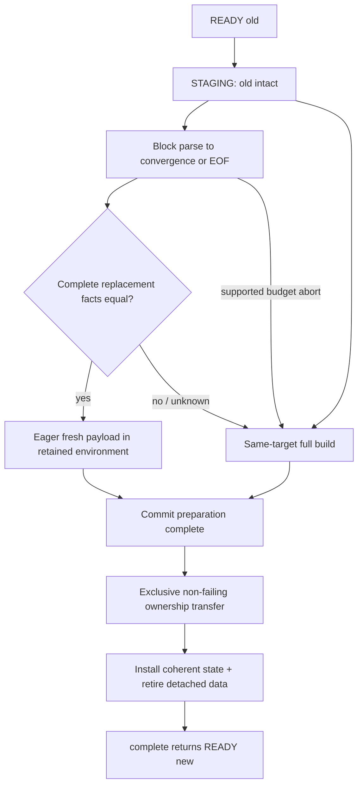

# Horse-A first independent design review — 2026-09-24

Status: **REVIEW ARTIFACT / NON-NORMATIVE INPUT TO #55**

This document preserves the decision-bearing output of the first independent review of Horse-A after issues #53 and #55 and draft PR #54 were created. It records why the candidate may proceed to data-model design while remaining **not ready for mechanism freeze or implementation**.

The normative design, if later frozen, must live in a reviewed fixed version of the Horse-A design authority; this review does not itself freeze the mechanism.

## Verdict

```text
MASTER_SHA = 5984cda65800573977d43e78d99a3a3e7fa1cd49
PR54_HEAD_AT_REVIEW = d9bcdbdc8f410779a303d5bb3913649414effea6

PROVENANCE_AUDIT = PASS
DOCUMENT_AUTHORITY_MODEL = CONDITIONAL_PASS
HORSE_A_RESEARCH_OBJECT = CORRECT
HORSE_A_MVP_SCOPE = MODIFY
DEFERRED_NOT_REJECTED_POLICY = ACCEPT
AST_STATE_MODEL = CONDITIONAL_PASS
UPDATE_STATE_MACHINE = CONDITIONAL_PASS
COORDINATE_MODEL = CONDITIONAL_PASS
ROOT_RESTART_MODEL = CONDITIONAL_PASS
SEMANTIC_PRESERVATION_MODEL = CONDITIONAL_PASS
WEIGHTED_SEQUENCE_CONTRACT = ACCEPT
AVL_FIRST_REALIZATION = ACCEPT
R1_R6 = MODIFY
W_A1_RESTART_WEAKNESS = CLEANLY_DEFERRED
W_A2_SEMANTIC_WEAKNESS = CLEANLY_DEFERRED
W_A3_LAYOUT_WEAKNESS = CLEANLY_DEFERRED

P0 = 0
P1 = 5
P2 = 4
P3 = 2

MECHANISM_IDENTITY_READY_TO_FREEZE = NO
READY_FOR_DATA_MODEL_DESIGN = YES
READY_FOR_IMPLEMENTATION = NO
```

The P1 items are unclosed **design obligations before freeze**, not five reproduced implementation bugs.

## Research object confirmed

Horse-A is not a new Markdown grammar/parser. BENCH-GRAMMAR-v1, NORMALIZED-RESULT-v1 and the shared block/inline core remain the experiment's semantic authority.

Horse-A studies the layer above a fresh parse:

```text
Markdown grammar / semantic core
        ↓
fresh complete AST / semantic result
        ↓
retained representation
        ↓ edit
incremental update
        ↓
new complete ready AST
```

The next question is therefore:

> Under a fixed safe local edit with a preservable semantic environment and bounded restart/propagation, can Markit eliminate work proportional to **unaffected retained state**, rather than merely make parser work local?

This is the correct post-#50 research object.

## Evidence direction retained

The review reconfirmed the relevant H0–H4 lessons:

| Horse | Useful mechanism | Avoidable/global cost exposed by current evidence |
|---|---|---|
| H0 | complete direct rebuild and semantic reference | repeats all parsing/materialization; current H0 cost is not the cost of building Horse-A ready state |
| H1 | damage localization and seam correctness | full tiling scan; suffix coordinate/span maintenance; fallback tax |
| H2 | syntax retention vs semantic rematerialization | global candidate/old-entry consultation and broad reference probing |
| H3 | old-subtree retention can be useful | repeated candidate construction/search and mapping degeneration |
| H4 | restart → forward parse → convergence/suffix take | global damage/definition traversal, prefix/suffix assembly, checkpoint reconstruction and old-handle retirement |

For #50's fixed local N witness, parser work remains bounded while several retained-state operations scale with M. The review also preserves the distinction between **283 total inspection bytes** and **138 unique post-source bytes**; those are different metrics.

## Horse provenance remains accurate

```text
H0 ← MD4C / pulldown-cmark / Comrak
H1 ← mizchi/markdown.mbt
H2 ← Lezer
H3 ← Tree-sitter (+ Wagner & Graham / Swift overlap)
H4 ← Wagner & Graham / Swift
     + Tree-sitter / Lezer convergence observations
```

Required interpretation:

```text
inspired mechanism model
!= upstream reproduction
!= upstream performance claim
```

Additional caveats:

- H1 results are not mizchi product-performance measurements.
- H2 results are not Lezer benchmark results.
- H3 results are not Tree-sitter product-performance claims.
- H4 is a multi-source mechanism abstraction; Wagner/Graham, Swift, Tree-sitter and Lezer do not use one identical convergence authority.
- For H0, prefer **"no old parse state reused for incremental computation"** over the literal claim that no old result is retained at all.

## Documentation authority after this review

| Artifact | Role |
|---|---|
| `AGENTS.md` + frozen protocol/grammar/result contracts | governance and semantic/measurement boundaries |
| raw Campaign-2 / #50 evidence | observations |
| `markit-31-research-synthesis.md` | durable evidence → lessons → compact provenance → next question |
| issue #53 | evolution roadmap and evidence triggers for later axes |
| issue #55 | current Horse-A mechanism candidate; reviewed does not mean frozen |
| `horse-provenance-and-evolution.md` | supporting provenance/evolution note; not mechanism authority |
| this review | non-normative review record explaining required corrections |

A future mechanism freeze should point to one reviewed, fixed design version. Editable issue bodies and support notes must not silently become co-equal freeze authorities.

## Five P1 obligations before mechanism freeze

| ID | Blocking design obligation | Required correction |
|---|---|---|
| A-01 | coverage has principles but no unique byte-ownership contract | define LF/trivia/indentation/empty/all-whitespace/EOF/boundary-insertion ownership; distinguish coverage from semantic spans |
| A-02 | root certificate support and invalidation are not closed | define an empty-root sufficient predicate, its source/parser support, seam invalidation and old/new convergence conditions |
| A-03 | materialization order conflicts with fact-comparison scope | freeze `block parse → complete replacement facts → environment decision → eager materialization` |
| A-04 | mutable splice lacks an explicit commit frontier | all fallible staging completes while old state is coherent; only then consume old ownership; commit has no algorithm fallback |
| A-05 | canonical R1–R6 can be read more strongly than Horse-A can satisfy | adopt scoped wording below; #55 remains candidate until a later freeze review |

## Additional P2/P3 corrections

P2:

1. Total complexity must expose RefTable lookup, owner-internal query cost, convergence-candidate cost and seam/source checks; `O(H+Δ+QH)` is structural maintenance only.
2. Owner, aggregates, AST definition facts and RefTable need one clear ownership/projection story to avoid duplicate mutable truths.
3. EOF completion must not be conflated with failed convergence; budget abort is valid only at actual responsive parser points.
4. A-R / Horse-B / A-P are independently attributable research axes, **not proven orthogonal knobs whose benefits can simply be added**.

P3:

1. Compact provenance should retain H1 fidelity caveats, H4's multiple convergence authorities and the precise H0 retained-state wording.
2. AVL is an accepted first realization, not a proven minimum or optimal layout.

## MVP scope after review

The following remain appropriate for Horse-A MVP:

```text
MUST for this experimental identity:
  byte-weighted ordered retained sequence
  certified restart/convergence
  owner-relative spans
  eager complete semantic payload
  same-target full rebuild
  local structural splice

GOOD MVP SIMPLIFICATIONS:
  one externally current version
  mutable retained representation
  root-only restart
  no consumer postings
  no stable cross-edit IDs
  no persistent locator map
  no COW/history/snapshot readers
  no nested checkpoints / arbitrary resumable container state
  no packed/chunked layout in the first realization
  no advanced selector
  no global reuse index
```

"Not in MVP" still means **deferred, not permanently forbidden**. Later additions require a separate experimental identity and evidence that the extra state/machinery earns its cost.

## Conceptual state responsibilities

| Component | Responsibility | Must not become |
|---|---|---|
| Authoritative Source + Version | only byte truth and edit provenance | a second independently mutable full-source copy inside the AST |
| ReadyDocument | one coherent source/syntax/semantic ready version | a second normalized tree or global per-owner version rewrite |
| OwnerSeq | source order, exact coverage, weighted locate, range split/join/retention | a flat parallel owner/checkpoint master table |
| Sequence aggregates | locally composable lookup/count summaries | a second semantic index rebuilt globally |
| Owner | retained top-level syntax ownership unit with exact source coverage | a semantic span pretending to be coverage |
| ASTPayload | complete eager block+inline result, semantic values, owner-relative spans and definition facts | a lazily repaired result or a duplicate permanent Skel tree |
| Restart certificate | proof that a sequence boundary is a valid empty-root restart | an arbitrary parser snapshot or version stamp |
| RefTable | document-global ordered first-wins lookup environment projected from syntax facts | an independently mutable second semantic truth |

Owner retention granularity and restart-safe boundary granularity are distinct. Not every Owner boundary is restart-safe.

## Coverage and coordinate contract to design next

The next data-model revision must make these properties exact:

1. Coverage segments partition `[0, source_len)` without overlap or holes.
2. LF, blank separators, leading/trailing trivia, indentation, all-whitespace input, empty input and EOF have exactly one ownership rule.
3. Coverage is not the same as semantic span; no normalized trivia nodes are invented merely for ownership.
4. Owner base is a weighted prefix sum; nested block/inline/content spans are relative to one Owner base.
5. Canonical edit endpoint affinity is explicit for zero-length insertion and boundary edits.
6. Paragraph merge/split and fence/container propagation may replace multiple Owners.
7. Whole-tree export uses sequential traversal + running base, avoiding one root seek per Owner.
8. `NODE_PATH_AT` complexity includes owner-internal search/output; locating the Owner in `O(log M)` does not by itself make the full query `O(log M)`.

## Root restart / convergence contract to design next

A root-safe restart must prove the absence of open paragraph/container/list/item/quote/fence state and other cross-boundary parser obligations.

An empty `ContextKey` alone is insufficient because the shared key does not encode an open paragraph.

Conservative examples that must be handled correctly include:

```text
a\nb\n              # second line can still belong to the same paragraph

> a
>
> b               # inner blank does not leave the quote

``` fenced body ``` # blank lines inside an open fence are body, not root separators
```

A convergence point must establish:

```text
mapped real old boundary
+ damage already crossed
+ valid old certificate
+ equivalent live empty-root continuation
+ unchanged-suffix edit mapping
+ exact coverage cut
```

EOF is a valid completion with an empty suffix. No convergence before EOF is not automatically a correctness failure.

## Semantic-preservation lemma to preserve

Let the proven syntax decomposition be:

```text
old = P · O · S
new = P · N · S
```

Let `Defs(X)` be the complete source-ordered sequence of normalized definition facts in X, including duplicates.

If P/S syntax and source order are proven unchanged and:

```text
Defs(O) == Defs(N)
```

then:

```text
Defs(old) == Defs(new)
```

and the document-global ordered first-wins RefTable is unchanged.

Important scope:

- O/N are the **complete restart→convergence/EOF replacement regions**, not merely edit bytes or the initially hit Owner.
- Equality is a sufficient condition; inequality does **not** prove that effective winners changed.
- Definition insertion/deletion, winner deletion and unresolved↔resolved transitions therefore take the conservative full-build path.
- Shadowed-definition edits may also conservatively rebuild; that remains the deliberate W-A2 weakness.
- New syntax nodes/spans are still rebuilt even when normalized facts compare equal.
- Fact normalization must come from the shared semantic core, not a second textual recognizer.

## Corrected high-level UPDATE order

```text
1. validate source/version/grammar/options/edit association
2. weighted-locate edit endpoints and seam obligations
3. select nearest still-valid certified root restart
4. keep old state intact; block-parse forward
5. test exact convergence at eligible boundaries; EOF is legal completion
6. extract ordered facts from the complete old/new replacement regions
7. if facts differ or preservation is unknown: same-target full build
8. if facts are equal: eagerly materialize fresh payload under the retained RefTable
9. finish all fallible staging and commit-resource preparation
10. cross the commit frontier
11. structurally transfer untouched prefix/suffix; splice fresh middle
12. repair only seam/path aggregates and certificates
13. install one coherent new association and retire detached state
14. return READY_new only after required retirement completes
```

The old externally usable state is guaranteed coherent only **before** the commit frontier. After the frontier, untouched ranges may be moved into the new representation; the system remains externally single-version.

OOM is not a magical reason to retry via full build. A future recoverable-allocation policy, if required, needs its own explicit ownership contract.

## Corrected state machine



## Weighted sequence and AVL verdict

`WEIGHTED_SEQUENCE_CONTRACT = ACCEPT`.

The mechanism needs a sequence representation that can support bounded weighted locate / boundary lookup, structural range split/join/retention, local aggregate repair and linear ordered traversal without walking untouched ranges merely to retain them.

`AVL_FIRST_REALIZATION = ACCEPT` only as a deliberately falsifiable first realization. It must support genuine join-based split/range replacement rather than replaying single-record insertion/deletion. Acceptance does not imply best cache locality, minimum memory or production optimality.

## Scoped R1–R6 wording

> **Scope.** R1–R6 prohibit maintenance proportional to unaffected retained state merely to locate, preserve, re-coordinate, certify, count, or retire that state during an incremental update. Their primary locality claim applies when the required syntax replacement, restart and propagation work, and local semantic-preservation proof are bounded independently of total retained size. They do not prohibit work for genuinely replaced payload, semantic changes, long parser propagation, actual removed-state destruction, an explicitly selected full rebuild, whole-result export, or document destruction. All such work remains visible in its declared cost boundary.

> **R1 — Local addressing and restart selection.** Locating edit coverage and selecting an eligible certified predecessor must use the retained sequence's local addressing and summaries; it must not require scanning all retained records. The selected restart may be far from the edit. Source inspection and parsing needed to re-establish continuation from that restart are separate, explicitly charged work and are not claimed to be logarithmic.

> **R2 — Structural retention.** Untouched prefix and suffix ranges must be retained by structural ownership transfer or an equivalent bounded range operation, without visiting, copying, or reinserting each retained record solely to preserve it. Boundary and balancing-path work is allowed and counted; processing newly built or actually removed records is charged separately.

> **R3 — Local coordinates and certificates.** A position shift before an unchanged suffix must not require per-record coordinate rewrites, checkpoint reconstruction, or context/generation re-registration throughout that suffix. Absolute positions may be derived from maintained weights. Only new boundaries, boundaries whose proof support changed, and affected aggregate paths require certificate or metadata repair; this repair must not conceal a global pass.

> **R4 — Local sufficient semantic certification.** The preserved-environment path must be decidable from the complete replaced region's old and new ordered definition facts, together with already-established prefix/suffix validity, without traversing unrelated syntax or reconstructing the entire definition table. Exact local fact equality is sufficient for Horse-A. Inequality or uncertainty may conservatively select same-target full rebuild even when effective winners happen not to be unchanged. Such false-positive rebuilds must be reported; selective winner/consumer maintenance is not required by Horse-A.

> **R5 — Ownership-proportional retirement.** An incremental splice must retire only detached, superseded state and its transient work; it must not walk and release the entire old representation merely to preserve untouched ranges. Destruction proportional to genuinely removed payload is allowed and included. A full rebuild or document destruction may retire the complete old state. Moving retirement outside the update boundary or into a later operation does not satisfy this requirement.

> **R6 — Local hot-path accounting.** Statistics or attribution required by the usable native mechanism must be produced from actual work events and locally maintained summaries, without an additional whole-retained-tree traversal on the incremental path. Pure oracle normalization, checksum, complete export, and explicitly separate diagnostic traversals may scan the complete result in their declared boundaries; they must not perform deferred parsing, semantic repair, index construction, or deferred retirement needed for READY state. Instrumentation cost and lane differences must remain explicit.

This wording is a **review proposal** until the design authority is revised and re-reviewed.

## Three weaknesses remain deliberately deferred

```text
W-A1  coarse root restart
      → A-R if B/K/container evidence shows restart/retention granularity matters

W-A2  conservative semantic certificate
      → Horse-B1 effective environment first; B2 selective repair only later

W-A3  binary-node layout
      → A-P only after structural locality passes and measured layout/allocation economics justify it
```

The axes are **independently attributable research directions**, not guaranteed orthogonal mechanisms. A-R may interact with retention granularity; B2 may require additional owner addressing or rematerialization input; packing may change boundary/metadata/relocation costs.

## Next data-model design agenda

Before another freeze review, #55 needs concrete logical contracts for:

1. `ReadyDocument`: READY meaning, source/grammar/options identity, exclusive update and failure disposition.
2. `OwnerSeq`: weighted locate, exact boundary, safe predecessor, split/join/range replace, cursor/iteration and access bounds.
3. Owner coverage: LF/trivia/gap/indentation/empty/EOF ownership and insertion affinity.
4. `ASTPayload`: complete block+inline output, all relative spans/content intervals, semantic values and definition facts; transient Skel state to discard.
5. RefTable relation: syntax facts → one ordered document environment; replacement-stream equality and full fallback.
6. Restart certificate: empty-root predicate, support region, seam invalidation, BOF/EOF and old/new convergence.
7. Sequence aggregates: one stated operation for every retained summary and a local recomputation rule.
8. UPDATE staging: parse state, mapping, facts, fresh payload, commit resources and abort cleanup while old stays coherent.
9. Ownership/retirement: unique commit frontier, untouched-range transfer, detached destruction and source/table lifetime.
10. Same-target full builder: blocks → final table → eager payload → coverage/certificates → balanced sequence.
11. Complexity/work accounting: separate H/Δ/Q, parser propagation, payload, definition lookup and export.
12. Close semantic counterexamples and re-review the fixed candidate before freezing mechanism identity.

## Gate after this review

```text
current #55 candidate
    ↓
data-model design closes A-01..A-05
    ↓
revise #55 / durable design artifact
    ↓
fresh independent design review
    ↓
MECHANISM_IDENTITY_READY_TO_FREEZE = YES ?
    ↓ only if YES
freeze Horse-A mechanism identity
    ↓
freeze STRUCTURAL-LOCALITY-N-1 falsification contract
    ↓
implementation
```

Until that gate passes:

```text
READY_FOR_DATA_MODEL_DESIGN = YES
READY_FOR_IMPLEMENTATION = NO
```
